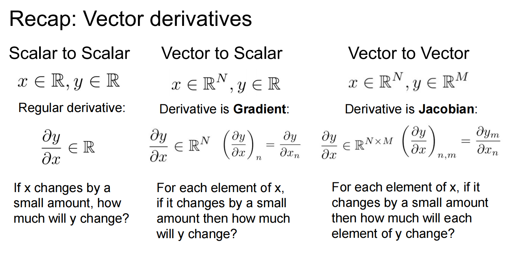

# 数字图像基础

对于黑白图像在计算机中是一堆按照顺序排列的数字，取值范围[0, 255]。0表示最暗，255表示最亮，这些数字又称为灰度值。

对于彩色图像，其颜色是由三原色（红R，绿G，蓝B）组合形成。

术语解释：
- 空间域，即图像平面本身，空间域的图像处理方法直接以图像像素操作为基础。
- 变换域，相对于空间域的图像处理方法，变换域首先把一副图像变换到变换域，在变换域进行处理，然后通过反变换把处理结果返回到空间域。

某些图像处理任务在空间域上执行更容易或更有意义，而另一些任务则更适合使用其他方法。

## 灰度变换与空间滤波

空间域处理主要分为灰度变换和空间滤波两类。

空间域处理的数学模型如下：
$$g(x, y) = T[f(x, y)]$$

其中f(x, y)表示输入图像，g(x, y)表示输出图像，T是在点(x, y)的领域上定义的关于f的一种算子。算子可应用于单幅图像或图像集合。

增强处理时对图像进行加工，使其结果对于特定的应用比原始图像更合适的一种处理。

灰度变换函数：
- 图像反转
- 对数变换
- 伽马变换
- 分段线性变换

直方图

空间滤波

平滑空间滤波器

锐化空间滤波器

## 图像几何变换

## 彩色图像处理

### 彩色模型

彩色模型的目的是在某些标准下用通常可以接受的方式方便地对彩色加以说明。

**RGB彩色模型**

在RGB模型中，每种颜色出现在红、绿、蓝的原色光谱分量中。

**HSI彩色模型**

HSI指色调、饱和度、强度。
暂时用不上。

# CS231

# Introduction

- Image Classification
- loss and optimazer
- Nerual Network and Backbo
- Convolution Network

## Image Classification

困难与挑战：
- Viewpoint variation（视角变化）.
- Scale variatioin（尺寸变化）.
- Deformation（形状变化）.
- Occlusion（遮挡）.
- （光照条件）
- backgound clutter（背景干扰）
- intra-class variation（类内差异）.

### 用于超参数调优的验证集

对于分类器而言，通常包含需要超参数，这个超参数不是训练得到的，而是人为设置的，并且设置的好坏也十分影响模型的性能。虽然超参数的设置很重要，但是并没有显而易见的设置方法，只能通过尝试的方法来决定超参数的取值。而测试某个超参数的值是否更高效的方式就是采用验证集来测试性能。

使用验证集来调优超参数的思路：从训练集中取出一部分数据当作验证集来调优，然后使用不同的超参数对验证集进行测试，选择效果最好的超参数，来测试真正的测试数据。

交叉验证。

特别注意：**绝不能使用测试集来进行调优**。当你在设计机器学习算法时，应该把测试集当作宝贵的资源，不到最后一步绝不使用它。如果你使用测试集来调优，而且算法性能看起来不错，这将给你带了一种假象，实际上当你算法实际部署后，性能可能会远远低于预期，因为**过拟合**。你的模型学习到的可能不是泛化能力，而是拟合测试集的能力。

## Backpropagation

每个门单元都会得到一些input并可以立即计算两个东西：
1. 这个门的output。
2. 以及该output对于各个input的梯度。

门单元完成这两件事是完全独立的，它不需要知道计算图中的其他细节。

当前向传播完成，开始反向传播，门单元将最终获得整个计算图的loss对于该门output的梯度值。根据链式法则，门单元将回传的梯度乘以它对其input的局部梯度，从而得到整个计算图的loss对于各个input的梯度。

对前向传播的变量进行缓存。

在不同分支的梯度应该累加。

矩阵对矩阵的求导...

一个求导简明扼要的解释：

个人理解，其实无论什么对什么求导，首先它得有它的数学意义而不是上来就是公式。不管是矩阵也好，向量也罢，假如A对B求导，A中有m个元素（如果是矩阵就是a\*b=m,向量就是m维向量，m为1就是单变量，甚至可以是张量，a\*b\*c=m,a\*b\*c\*d=m等等）,B中有n个元素。那么A对B求导就应该有m\*n个元素，即A中每个元素对B中每个元素的偏导数。现在有了这些个元素，至于这些元素要以什么样的形式摆放（就如你到处都能看到的教材或资料中的什么单变量对向量求导是行向量，向量对单变量求导是列向量，向量对向量求导是矩阵等等），其实就是要找到一种符合直觉的利于计算的（比如在矩阵／向量求导中便于使用chain rule计算导数等）统一的定义就行。刚好矩阵本身就定义了一种很符合需求的算子，所以就有了你看到的各种矩阵求导所定义的形式。（其实你如果不满意，你大可自己尝试定义一种对上述m\*n个元素的放置方式，使得你的定义能满足你的一切计算需求。不过我相信你很难找到一种比目前定义更好的定义方式）

作者：Gary
链接：https://www.zhihu.com/question/39523290/answer/221129395

## 神经网络

### 常用激活函数

**Sigmoid**。

然而现在sigmoid函数已经不太受欢迎，实际很少使用了，因为它有两个主要的缺点：
- sigmoid函数饱和使得梯度消失。
- sigmoid函数的输出不是零中心的。

**Tanh**。

**ReLU**。

## Tranning Nerual Network

### Activate Functions

Activate Function choose  three problem:
- saturate?
- zero-centered?
- compute efficiently?

饱和（saturate）是指函数会变得很平，并且对输入的微小改变会变得不敏感。

In practise:
- 

### Data Preprocessing

- Zero-mean.
- Normalizing.
- PCA.
- Whitening.

### Weight Initialization

symmetry

在开始训练网络之前，还需要初始化网络的权重参数。

### Batch Normalization

Usually inserted after FC or CONV layer and before nonlinearity.

将输入数据转换为单位高斯输出

### Regularization

Regularization: Add term to loss.

In common use:
- L2 regulization
- L1 regulization
- Elastic net

#### Dropout

Dropout可以被认为是对完整的神经网络抽样出一些子集，每次基于输入数据只更新子网络的参数。

## Convolution Network

- Convolution Network stack CONV, POOL, FC layers.
- Trend towards smaller filters and deeper architectures.
- Trend towards getting rid of POOL/FC layers (just CONV).
- Typical architectures loook like **[(CONV-->RELU)\*N-->POOL]\*M-->(FC-->RELU)\*K, SOFTMAX**

### 卷积和池化操作

**Summary**. To summarize, the Conv Leyer:
- Accepts a volume of size $W_1 * H_1 * D_1$
- Requires four hyper parameters:
  - Numbers of filter $K$,
  - The filter size $F$,
  - The stride $S$,
  - The zero padding $P$.
- Produces a volume of size $W_2 * H_2 * D_2$ where:
  - $W_2 = (W_1 + 2P - F) / S + 1$
  - $H_2 = (H_1 + 2P - F) / S + 1$
  - $D_2 = K$ 
- With parameter sharing, it introduces $F * F * D_1$ weights for per filter, for a total of $(F * F * D_1) * K$ weights and $K$ biases.
- In the output volume, the $d$-th depth slice (of size $w_2 * H_2$) is the result of performing a valid convolution of the $d$-th filter over the input volume with a stride of $S$, and the offset by $d$-th bias.

> btw, 1 x 1 convolution layers make perfect sense. The reason behind using these 1 x 1 convolutional layers is dimensionality reduction. 1 x 1 convolutions do not change the width and height of the image representation but can alter the depth of an image representation.

**Summary**. To summarize, the Pooling:
- Accepts a volume of size $W_1 * H_1 * D_1$
- Requires three hyper parameters:
  - the spatial extent $F$,
  - the stride $S$.
- Produces a volume of size $W_2 * H_2 * D_2$ where:
  - $W_2 = (W_1 - F)/S + 1$ (Note: no padding)
  - $H_2 = (H_1 - F)/S + 1$ (Note: no padding)
  - $D_2 = D_1$
- Introduces zero parameters since it computes a fixed function of the input
- Note that it is not common to use zero-padding for Pooling Layer

## CNN architecture

### AlexNet

创新点：
- **使用ReLU激活函数代替sigmoid和tanh，加快了训练速度。**
- 使用了LRN（Local Response Normalization），但已经被证明基本没有效果。
- 使用overlaping pool（CNNs中的Pool层一般不会重叠）。
- 使用的data augrmentation。
- **使用了Dropout。**

### ZFNet

创新点：
- **使用了反卷积，可视化feature map。通过feature map可以看出，前面的层学习的是物理轮廓、边缘、颜色、纹理，后面的层学到的是和类相关的抽象特征。**
- 与AlexNet相比使用更小的filter，更小的stride。
- 通过遮挡
- **通过实验说明了深度的增加可以学习到更好的特征。**

### VGGNet

### GoogleNet

创新点：
- 使用了1 x 1卷积。
- 使用inception结构。
- 

### ResNet

创新点：
- 发现degradation problem，更深的网络准确率未必更好。
- 引入残差结构，解决深层网络难以训练的问题。

### ResNeXt

### SENet

### DenseNet

Summary:
- **AlexNet** showed that you can use CNNs to train Computer Vision models.
- **ZFNet**, **VGG** shows that bigger networks work better.
- **GoogleNet** is one of the first to focus on efficiency using 1 x 1 bottleneck convolutions and global avg pool instead of FC layers.
- **ResNet** showed us how to train extremely deep networks:
- After ResNet: CNNs were better than the human metric and focus shifted to Efficient Networks:
  - Lots of tiny networks aimed at mobile devices: **MobileNet**, **ShuffleNet**.
- **Neural Architecture Search (NAS)** can now automate architecture design.