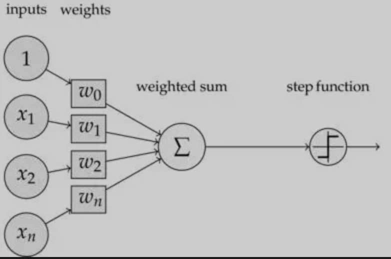

# DL

DL，即Deep Learning=深度学习。

**What**

在人工智能领域里，有一个方法叫机器学习，而机器学习里面有一类算法叫神经网络，而深度学习就是使用深层神经网络进行学习的方法。

## 数字图像基础

对于黑白图像在计算机中是一堆按照顺序排列的数字，取值范围[0, 255]。0表示最暗，255表示最亮，这些数字又称为灰度值。

对于彩色图像，其颜色是由三原色（红R，绿G，蓝B）组合形成。

## 数学基础

### 方向导数与梯度

『导数』是函数的局部性质，一个函数在某一点的导数描述了这个函数在这一点附近的变化率。

『方向导数』顾名思义就是某个方向上的导数。

对于一元函数 $y = f(x)$，其自变量为一元，因此只有一个方向的方向导数，即沿着x轴方向的导数（因为x只能增加或减少）。

而对于多元函数，如二元函数 $z = f(x, y)$，其自变量为二元，因此可以朝着一个平面的任意方向进行改变，因此有无数个方向导数。

在这无数个方向导数中，有两个特殊方向（即沿着坐标轴x和y轴）的方向导数称为偏导数。

### 梯度下降算法数学原理

神经网络的梯度下降法能够朝着正确方向行进的本质是：[泰勒公式](https://zhuanlan.zhihu.com/p/36564434)。

有三种不同的梯度下降算法，其区别在于使用多少数据来计算目标函数的梯度（根据我们手上的数据量，我们折中考虑权重参数更新的准确率以及参数更新的频率）：
- BGD（Batch Gradient Descent，批量梯度下降法），利用所有训练数据来计算权重参数的梯度后更新梯度，权重参数更新方向准确，但更新频率低。对于凸误差表面，BGD保证能够到达全局最小值，而对于非凸表面，BGD保证能到达一个局部的最小值（并且困于此，不会逃出）。
- SGD（Stochastic Gradient Descent，随机梯度下降法），利用每一个样本计算一次权重参数的梯度并更新梯度，权重参数更新方向不一定准确（目标函数会波动），但更新频率高。由于SGD的波动，可能会使得权重参数逃离当前的局部最小值，到达另一个更小的局部最小值，不过SGD难以逃离鞍点。
- MBGD（Mini-Batch Gradient Descent，小批量梯度下降法），以上两种的折中，也最常用。

> SGD-M优化
> 
> The momentum term increases for dimensions whose gradients point in the same directions and reduces updates for dimensions whose gradients change directions. As a result, we gain faster convergence and reduced oscillation.

> NAG
> 

### 计算机中实现梯度下降——计算图

假设我们优化的目标函数为 $J(a, b, c) = 3(a + b*c)$

我们令 $u = b*c$，$v = a + u$，$J = 3*v$

则我们的计算图如下（设a = 5, b = 3, c = 2）：

得到结果为33，这就是一次前向传播的过程（forward）。

计算图通常包含两种元素：
- tensor，即输入输出数据。
- Function，某个节点的激活函数，内部包括`forward`、`backward`两个方法，分别用于前向和反向。

如果我们想计算目标函数 $J$ 对于各个自变量的导数，则我们需要反向传播。

**反向传播的推导与编程实现**

网络结果如下图：

目标函数： $E = \frac{1}{2}\sum\limits_{i\in outputs}(t_i - y_i)^2$

符号定义：
- $net_j = \vec{w_j} \cdot \vec{x_j} = \sum\limits_{i}w_{ji}x_{ji}$，其中 $net_j$ 表示节点 $j$ 的输入加权和，$\vec{w_j}$ 表示节点 $j$ 的输入权重， $\vec{x_j}$ 表示节点 $j$ 的输入特征。

由于 $E$ 是 $net_j$ 的函数，而 $net_j$ 是 $w_{ji}$ 的函数，根据链式法则有：
- $\frac{\partial{E}}{\partial{w_{ji}}}=\frac{\partial{E}}{\partial{net_j}}\cdot\frac{\partial{net_j}}{\partial{w_{ji}}}$

对于 $\frac{\partial{net_j}}{\partial{w_{ji}}}$ ，其计算方法不管是在隐藏层还是输出层都是一样的，结果都为：
- $\frac{\partial{net_j}}{\partial{w_{ji}}}=x_{ji}$，其中 $x_{ji}$ 为节点 $i$ 的输出值。

而对于 $\frac{\partial{E}}{\partial{net_j}}$ 的计算则需要区分是输出层还是隐藏层。

*输出层的权重训练*

对于输出层，$net_j$ 通过影响节点 $j$的输出值 $y_j$来影响网络的其他部分，即 $E$ 是 $y_j$ 的函数，而 $y_j$ 是 $net_j$ 的函数。其中 $y_j=sigmoid(net_j)$。所以根据链式求导法则：
- $\frac{\partial{E}}{\partial{net_j}}=\frac{\partial{E}}{\partial{y_j}}\cdot\frac{\partial{y_j}}{\partial{net_j}}$

考虑上式的第一项：
- $\frac{\partial{E}}{\partial{y_j}}=\frac{\partial}{\partial{y_j}}\frac{1}{2}\sum\limits_{j\in outputs}(t_j - y_j)^2=-(t_j- y_j)$

考虑上式第二项：
- $\frac{\partial{y_j}}{\partial{net_j}}=y_j(1-y_j)$

将以上两项带入：
- $\frac{\partial{E}}{\partial{net_j}} = -(t_j - y_j)y_j(1-y_j)$

此时我们令：
- $\delta_j = -\frac{\partial{E}}{\partial{net_j}}=(t_j-y_j)y_j(1-y_j)$

*隐藏层权重训练*

对于隐藏层，首先我们定义节点 $j$ 的所有直接下游节点的集合为 $Downstream(j)$，例如对于网络结构图中节点4，其直接下游节点集合节点8和9。可以看到 $net_j$只能通过影响集合 $Downstream(j)$ 中的节点的输入值来进一步影响 $E$。设 $net_k$ 为是节点 $j$的下游节点的加权和输入，则 $E$ 是 $net_k$的函数，而 $net_k$ 是 $net_j$ 的函数。因为$net_k$有多个，这里应用全导数公式，可得到：
- $\frac{\partial{E}}{\partial{net_j}}=\sum\limits_{k \in Downstream(j)}\frac{\partial{E}}{\partial{net_k}}\frac{\partial{net_k}}{\partial{net_j}}$
- $=\sum\limits_{k \in Downstream(j)}-\delta_k\frac{\partial{net_k}}{\partial{net_j}}$
- $=\sum\limits_{k \in Downstream(j)}-\delta_k\frac{\partial{net_k}}{\partial{a_j}}\frac{\partial{a_j}}{net_j}$
- $=\sum\limits_{k \in Downstream(j)}-\delta_k w_{kj}a_j(1-a_j)$
- $=-a_j(1-a_j)=\sum\limits_{k \in Downstream(j)}-\delta_k w_{kj}$

因为，我们令：
- $\delta_j = -\frac{\partial{E}}{\partial{net_j}}$

因此，对于隐藏层的误差项：
- $\delta_j = a_j(1-a_j)\sum\limits_{k \in Downstream(j)}\delta_k w_{kj}$

则各层的权重训练公式如下：
- $w_{ji} \leftarrow w_{ji} - \eta\frac{\partial{E}}{\partial{w_{ji}}} = w_{ji} + \eta\delta_j x_{ji}$

因此，反向传播的过程就是从后往前传递误差项，然后根据误差项计算梯度。

## 神经网络

神经网络如下图所示：

图中每个圆圈都是一个神经元，每条线表示神经元之间的连接。上面的神经元被分成了多层，层与层之间的神经元有连接，而层内之间的神经元没有连接。

一个神经网络的架构分层一般分为三层：
- 最左边的输入层（Input Layer, 1层）
- 中间的隐藏层（Hidden Layer, >=1层）
- 最右边的输出层（Output Layer, 1层）

隐藏层比较多的神经网络称为深度神经网络。

**神经元**

神经网络的基本组成结构是神经元。

一个神经元的结构如下图：

其组成部分有：
- 输入权值（Input & Weight）。一个神经元可以接受多个输入，每个输入上都有一个权值，此外还有一个bias偏置项。
- 激活函数（activate function）。激活函数有多重选择。
- 输出。每个神经元都会产生一个输出，可能作为下一层神经元的输入。输出的计算方式 $y = f(w * x + b)$

> Q：[为什么要有激活函数？](https://www.zhihu.com/question/22334626)
> 
> A：激活函数是用来加入非线性因素的，解决线性模型不能解决的问题。

目标函数

损失函数

优化算法

我们的目标是使得目标函数最优，每次根据样本的标签和预测计算损失，然后求得目标函数，根据优化算法进行优化。

实际上根据神经元的不同连接方式有不同的神经网络：
- 卷积神经网络
- 循环神经网络
- 长短时记忆神经网络
- 递归神经网络

## CNN——卷积神经网络

### CNN的发展史

CNN1989年问世：
- 第一个CNN称为**ConvNet**，该模型可以用于可视化认知任务，例如手写数字识别。
- 1998年，改进后的ConvNet的模型**LeNet**问世，由于其高准确率被工业界采用，自此CNN模型变成最成功的机器学习模型，工业界和学术界都广泛使用。
- 1998年自2012年，AlexNet
- VGG
- ResNet
- DenseNet
- EfficientNet

feature map的尺寸计算方式： 
- $(input\_size + 2 * padding\_size - filter_size) / stride + 1$

把filter看成特征提取器，由神经网络自己训练，越深的网络提取的特征越深越具有一般性。

## RNN——循环神经网络

## LSTM——长短时记忆神经网络

## 递归神经网络

## 名词概念

**Ground Truth**
- 译为：地面实况。在机器学习中就是『参考标准』，预测结果根据该参考标准计算损失，并优化该损失，在有监督学习中，可以简单理解成标签。

例如目标检测情景中：

**iteration**
- 一个iteration（中译：迭代），每次迭代更新一次网络结构的参数。

**batch-size**
- 一次迭代所使用的样本称为batch，其数量称为batch-size。

**epoch**

- 一个epoch（中译：轮次）指的是遍历完训练集里的每一个样本，即跑完所有batch。
- 多个epoch的目的是为了寻找全局最低值，因为一个epoch可能到不了全局最低值（参见：[Why are multiple epochs needed for deep learning?](https://www.quora.com/Why-are-multiple-epochs-needed-for-deep-learning)）。
- 每次epoch通常伴随着shuffle（参见：[浅谈深度学习shuffle问题](https://blog.csdn.net/g_b_l/article/details/109600536)）。

**regularization**
- 译为：正则化。用于防止过拟合。
- 主要有两种手段：
  - L2正则化。
  - Dropout正则化。

**normalization**
- 译为：归一化。用于消除不同数据之间的量纲，方便数据比较和共同处理。
    - 线性转换：$y = \frac{x - min}{max - min}$
    - 非线性转换：如对数转换和反余切函数转换。

**gradient vanish& explode**
- 译为：梯度消失和梯度爆炸
- 梯度消失是指训练过程中，梯度值几乎消失（变得很小），使得权重无法得到有效更新
- 梯度爆炸是指训练过程中，梯度值呈现指数增长。

**fine-tuning**
- 译为：微调。用于迁移学习。

**sota**
- sota是state-of-the-art的简写，表示最先进的。

## 答疑

