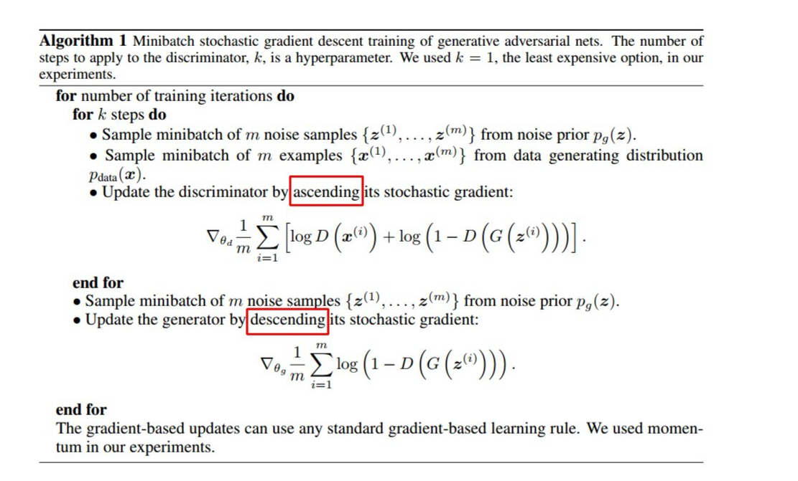

# DL外的领域知识

## 语义分割

## 生成对抗网络（GAN）

GAN的基本原理很简单，以生成图片为例。假设我们有两个网络：G（Genrator）和D（Discriminator）：
- G是生成图片的网络，它接受一个随机噪声z，通过这个噪声生成图片，记作G(z)。
- D是判别网络，判别一张图片是不是真实的，它的输入为x，x代表一张图片，输出D(x)代表x为真实图片的概率，如果为1，就代表100%是真实的图片，而输出为0，就代表不可能是真实的图片。

在训练过程中，生成网络G的目标是尽量生成真实的图片去欺骗判别网络D。而D的目标就是尽量把G生成的图片和真实图片区分开来（给真实图片很高的置信度，而假图片很低的置信度）。G和D构成了一个动态博弈过程。

最后博弈的结果，最理想条件下，G可以生成足以以假乱真的图片G(z)。对于D来说，它难以判断G生成的图片究竟是不是真的，因此D(G(z))=0.5。

用数学语言来描述就是：

训练细节：

G和D是交替训练的，并且优化的方向和东西都不一样。

## 注意力机制（Attention）

按注意力机制的可微性，可分为：
- Hard-Attention，即0/1问题，某个区域要么被关注，要么不关注，不可微。
- Soft-Attention，[0, 1]连续分布问题，用0到1的不同权重表示每个区域被关注程度的高低，可微。

按注意力机制的关注域，可分为：
- 空间域spatial domain
- 通道域channel domain
- 层域layer domain
- 混合域mixed domain
- 时间域time domain

### CNN with Attention

主要分为两种，一种是spatial attention，另外一种是channel attention。

Attention机制听起来高大上，其实就是学习出一种权重映射图，再拿这个权重映射图加在原来的特征之上，就叫Attention。

Q：为什么仅仅通过矩阵相乘，就可以建模像素和全局的联系。

A：我们熟知的图像分类网络，最后有一个FC层，目的是做矩阵的乘法，如果对应位置得到一个很大的值，说明属于这一类的概率很高，矩阵相乘本质也是向量相乘。那么对于自注意力。如果大家仔细阅读，会发现相乘的这两个矩阵本身reshape的方式不一样。他们之间的矩阵相乘，内部其实是一个像素对应的特征向量和其他所有位置的特征向量的乘积。self attention其实是想通过点积（dot）的方式，优化向量的距离，即点积相似性：如果两个向量的乘积越大，姑且可以认为这两个向量在特征空间的分布距离很近，则它们很相似。以此来建模像素之间的联系。

## 概念

### backbone

backbone，译为骨架，通常指提取特征的卷积网络。

### embedding

embedding，译为嵌入。

数学上的概念就是从一个空间映射到另一个空间，保留基本属性。

embedding这个概念是在NLP中的，机器学习算法大部分没办法直接处理字符串，类别等特征需要转换成计算机中的表示，如果简单的使用1，2，3会人为引入偏差，所以最早的做法是使用ont-hot，但是one-hot也存在问题，那就是虽热人为的偏差没了，可是本来内在的关系也没了（ont-hot表示中两个不同类别的距离一样。）

所以干脆一个类别分配一个向量，但是这个向量的值是多少呢？不知道，但不重要，让网络自己学习就行。

因此embdding就是一个向量，该向量是原数据的映射。
