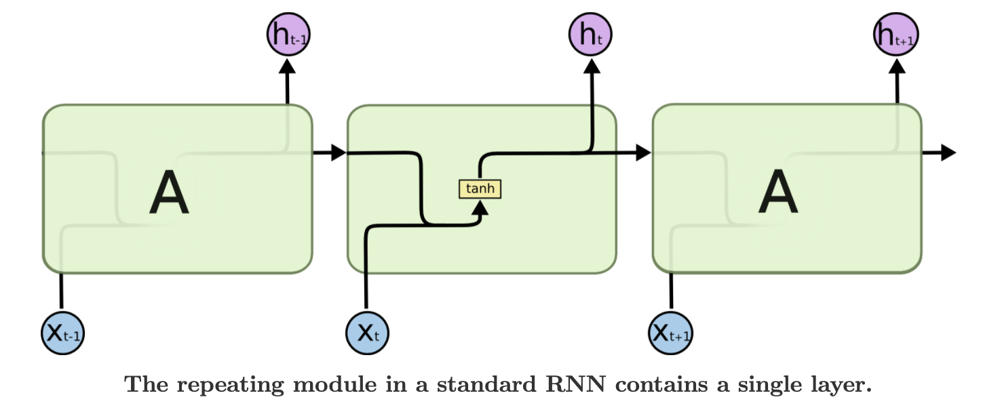
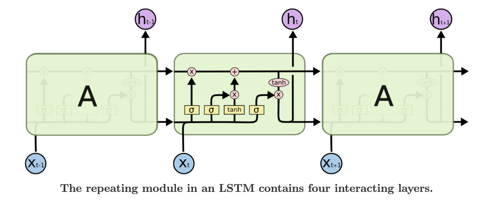

# 神经网络与深度学习

## 机器学习概述

欠拟合：
- 模型表达能力不够。

过拟合：训练集上错误率很低，测试集上错误率很高。
- 训练数据少。

## 1. 线性模型

### 线性回归模型

### 线性分类模型

- 二分类
- 多分类

## 2. 非线性模型——神经网络

### 前馈神经网络（全连接神经网络、多层感知机）

前馈神经网络，也称为全连接神经网络或多层感知机。

前馈神经网络的作用

一个网络模型只要反向传播能够顺利进行（不会出现梯度爆炸或者梯度消失）那么就能被用于训练。

### 卷积神经网络CNN

**卷积神经网络CNN的核心作用：特征提取器**

**1. 什么是特征？**

特征就是可以清晰描述一个对象的各种属性集合。

**2. 如何提取？**

一副图像是一个像素值构成的矩阵，因此一副图像中的对象也是由像素值构成，但对于某类图像这些像素值的分布是有规律的，即满足某种模式pattern。所谓提取特征就是利用某种技术在图像中匹配某些像素值的模式来确定是否存在某些特征。

CNN就是采用「滑动窗口」的方式来匹配。通过将filter在图像上滑动我们在图像上匹配特征，而利用不同的fliter来匹配不同的特征，然后利用这些特征进行组合得到一个语义。

CNN越后层提取到的信息越高级，越具有语义信息（因为它是将底层提取的特征进行组合）。

**较浅的卷积层感受野较小，学习到一些局部区域的特征；较深的卷积层就有较大的感受野（实际上虽然是相同的filter大小，但是由于是上一层fliter卷积后的结果，因此可以看成是上层特征的组合），能够学习到更加抽象的特征。**

我们训练CNN就是希望训练得到一个特征提取器：该特征提取器输入图片并提取其特征得到特征向量，并且该特征提取器提取的特征向量对于不同类别对象的在特征空间能够区分开来（对于同样类别的特征靠近，而对于不同类别的特征疏远）。

卷积神经网络的结构趋势是：
- 小卷积核，大深大
- 将全连接层替换成卷积层

### 全卷积神经网络FCN

FCN将传统的CNN中的全连接层转化成一个个的卷积层。

**上采样Unsampling**

上采样指的是任何可以让你的图像变成更高分辨率的技术。

最简单的方式就是重采样和插值：将输入图片进行reshape到一个想要的尺寸，并计算每个点的像素值，使用如双线性插值等插值方法来对其余点进行插值来完成上采样过程。

**反池化Unpooling**

Unpooling是max pooling的逆操作。但鉴于max pooling不可逆，因此使用近似的方式来翻转得到max pooling操作前的原始情况。

实现原理：在max pooling的时候记住最大item的位置，还原的时候除了一个窗口的最大item保持不变外，其他位置全0。

**反卷积Deconvolution**

反卷积，也称为转置卷积，他并不是正向卷积的完全逆过程，相反它是一种特殊的正向卷积，先按照一定的比例通过补0来扩大图像的尺寸，接着旋转卷积核，再进行正向卷积。

实际上通过反卷积操作并不能还原卷积之前的图片，只能还原出卷积之前图片的尺寸。

使用反卷积来对图像进行上采样是可以学习得到的。通过用来对卷积层结果进行上采样，使其回到原始图片的分辨率。

实验原理：将得到的feature map进行pading或者dilation然后利用filter进行卷积，这个filter是通过训练学习得到的。

**1X1卷积**

## 残差网络——ResNet

残差网络即可以指ResNet，也泛指所有使用了残差连接的神经网络。

残差连接的提出是为了解决深度神经网络训练困难问题。

为什么ResNet能work？

## 循环神经网络RNN

卷积神经网络CNN的每个输入-输出对都是孤立的，不考虑该输入-输出所处的上下文。然而对于某些应用如机器翻译，每个输入词-输出词的翻译不是孤立的，某个特定位置的输入与其所处的位置（语境or上下文）有密切关系，因此对于输入-输出对不能孤立看待而要结合该输入-输出对的位置（语境or上下文）来综合考虑。

CNN无法很好的处理序列信息的关键是其网络没有记忆功能。

**循环神经网络RNN的核心作用取决于你如何使用：**
- RNN可以处理变长序列任务
- RNN会对序列中的输入进行编码存储，因此最后一个hidden state保存了所有输入的信息，可以作为encoder

**Standard RNN**

**基本思想：为此我们需要一个具有的“记忆”功能的神经网络——RNN。我们就可以记住之前输入-输出信息（上下文）——即将之前的输入-输出信息编码存储起来，接着通过这些存储的信息（上下文）和当前输入来做出当前输出的决策，最后将当前输出也编码进输入-输出信息存储起来用于下一次决策。**

Standard RNN对于短依赖的序列效果很好，但也存在以下问题：
- 长期依赖问题
- 容易梯度消失或爆炸

**LSTM**

为了解决Standard RNN的问题，提出了LSTM。

LSTM利用「门单元」和「单独的cell state」来解决Standard RNN中的问题，其中包括4类门单元：
- forget gate
- input gate
- output gate

**LSTM变种**

- preehold
- GRU

[Understanding LSTM](http://colah.github.io/posts/2015-08-Understanding-LSTMs/)

RNN训练的数据通常是序列数据，如语音、字符流等，我们需要首先将他们转化成对应的vector，即「embedding」。比较常用的方法是word2vec。

**CTC**

可以输出null，满足输出空的需求。

**Seguence-to-sequence Auto-encoder模型**

RNN可以作为一个Encoder，将其最后一个cell的memory作为整个序列的特征输入到Decoder并使用ground truth进行训练，使得Encoder能够学会如何编码，而Decoder能够学会如何解码。

**因此RNN也具有编码的作用，我们可以使用RNN来编码序列信息！同时RNN也具有解码的作用，可以使用RNN来解码！**

## 4. AutoEncoder

## 5. 注意力机制

**注意力机制直观理解**

[What exactly are keys, queries, and values in attention mechanisms?](https://stats.stackexchange.com/questions/421935/what-exactly-are-keys-queries-and-values-in-attention-mechanisms)

## 6. Transformer

引入了自注意力机制。

**而各种不同的应用都是基于CNN对图像进行特征提取来进行的，我们可以把不同的应用看成不同的任务，而这些任务都是基于特征进行的：**
- **例如分类任务：通过CNN提取特征，接着利用全连接层+softmax将特征向量映射到类别向量。**

## 7. 生成对抗网络GAN

## 强化学习

## 9. Meta Learning

## Others

Q: 人脸识别为什么用计算相似度来区分两个人脸？而不直接训练一个人脸分类网络？

A： 

- 分类网络一般是分猫、狗这样的大类，有很多个体算到一个类里面。但在人脸识别中，每个人脸都是独一无二的，属于一个类，此时如果每个使用人脸分类网络，则每个人的人脸将作为一个类别，最后输出评分时计算量将非常大，且输出矩阵也将非常大。
- 人脸分类网络的训练都是offline的，如果有新的用户加入，该分类网络将无法正确分类，因为训练时并没有该用户的数据和类别。相反，使用相似度来度量的话，我们可以训练一个人脸特征提取器，该特征提取器能提取人脸的通用特征，当新用户注册时，我们收集其人脸并提取特征保存在数据库中作为template，当新用户使用该系统时，我们再次提取其人脸特征并与系统数据库中的所有template进行相似度计算，并使用一个阈值来判断是否是相同人脸（或者是否人脸），以此来实现人脸识别。