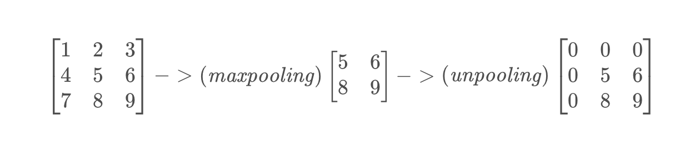

# DL理解

## 0. 神经网络

一个网络模型只要反向传播能够顺利进行那么就能work！

## 1. 卷积神经网络CNN

虽然卷积神经网络CNN，被用于各种领域，如目标检测、分割等，**但是CNN真正的作用，只是起到一个特征提取器的作用！** 

**而各种不同的应用都是基于CNN对图像进行特征提取来进行的，我们可以把不同的应用看成不同的任务，而这些任务都是基于特征进行的：**
- **例如分类任务：通过CNN提取特征并利用全连接层+softmax将特征层映射到类别层。**

**什么是特征？**

特征就是可以清晰描述一个对象的各种属性集合。

**如何提取？**

一副图像是一个像素值构成的矩阵，因此一副图像中的对象也是由像素值构成，但这些像素值的分布是有规律的，即满足某种模式pattern。所谓提取特征就是利用某种技术在图像中匹配某些像素值的模式来确定是否存在某些特征。

CNN就是采用「滑动窗口」的方式来匹配。通过将filter在图像上滑动我们在图像上匹配特征。

CNN越后层提取到的信息越高级，越具有语义信息（因为它是将底层提取的特征进行组合）。

**较浅的卷积层感受野较小，学习到一些局部区域的特征；较深的卷积层就要较大的感受野，能够学习到更加抽象的特征。**

## 2. 全卷积神经网络FCN

FCN将传统的CNN中的全连接层转化成一个个的卷积层。

**上采样Unsampling**

上采样指的是任何可以让你的图像变成更高分辨率的技术。

最简单的方式就是重采样和插值：将输入图片进行reshape到一个想要的尺寸，并计算每个点的像素值，使用如双线性插值等插值方法来对其余点进行插值来完成上采样过程。

**反池化Unpooling**

Unpooling是max pooling的逆操作。但鉴于max pooling不可逆，因此使用近似的方式来翻转得到max pooling操作前的原始情况。

实现原理：在max pooling的时候记住最大item的位置，还原的时候除了一个窗口的最大item保持不变外，其他位置全0。

**反卷积Deconvolution**

反卷积，也称为转置卷积，他并不是正向卷积的完全逆过程，相反它是一种特殊的正向卷积，先按照一定的比例通过补0来扩大图像的尺寸，接着旋转卷积核，再进行正向卷积。

实际上通过反卷积操作并不能还原卷积之前的图片，只能还原出卷积之前图片的尺寸。

使用反卷积来对图像进行上采样是可以学习得到的。通过用来对卷积层结果进行上采样，使其回到原始图片的分辨率。

实验原理：将得到的feature map进行pading或者dilation然后利用filter进行卷积，这个filter是通过训练学习得到的。

## 3. 循环神经网络RNN

CNN对于同一输入有同样的输出（这当然也是我们想要的），然而对于某些应用，在不同上下文的相同输入，它们的含义是不相同的，可能对应不同的输出。而这在CNN是无法实现的，因为CNN没有“记忆”功能。

**为此我需要一个具有的“记忆”功能的神经网络——RNN。我们就可以记住上下文，并通过上下文来做出最终的决策。**

所谓“记忆”，最简单的方式就是将上一个时间点的某些输出保存起来，然后再下一个时间点的计算输出时同时考虑这些保存的输出来得出最终的输出。

常用的RNN为LSTM。

RNN训练的数据通常是序列数据，如语音、字符流等，我们需要首先将他们转化成对应的vector，即「embedding」。

**CTC**

可以输出null，满足输出空的需求。

**Seguence-to-sequence Auto-encoder模型**

RNN可以作为一个Encoder，将其最后一个cell的memory作为整个序列的特征输入到Decoder并使用ground truth进行训练，使得Encoder能够学会如何编码，而Decoder能够学会如何解码。

**因此RNN也具有编码的作用，我们可以使用RNN来编码序列信息！同时RNN也具有解码的作用，可以使用RNN来解码！**

## 4. 注意力机制

目的：

## 5. Transformer

## 6. 生成对抗网络GAN

