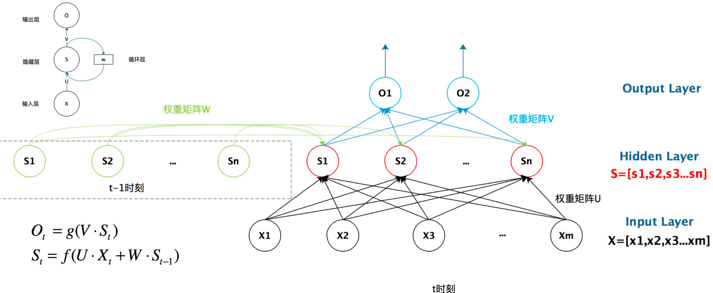
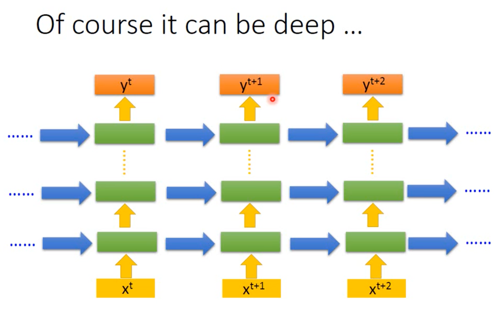
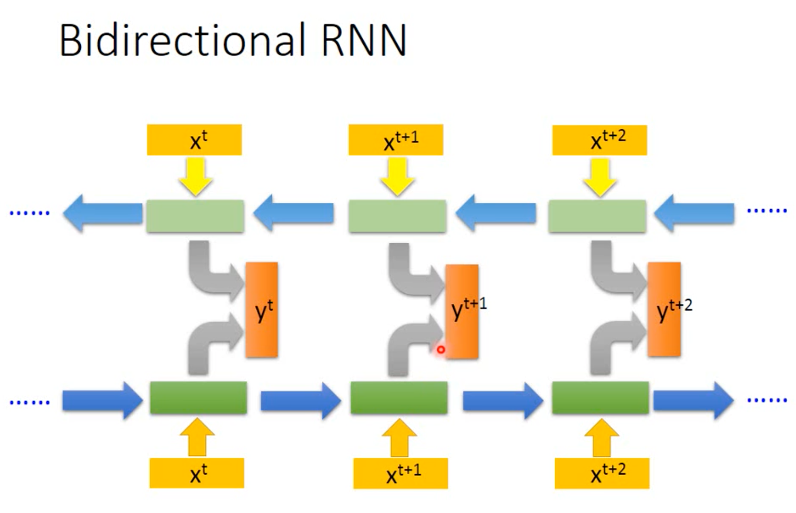
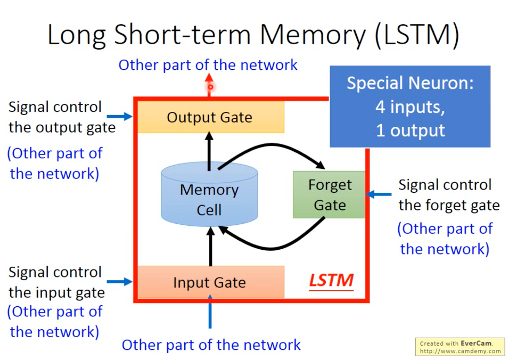
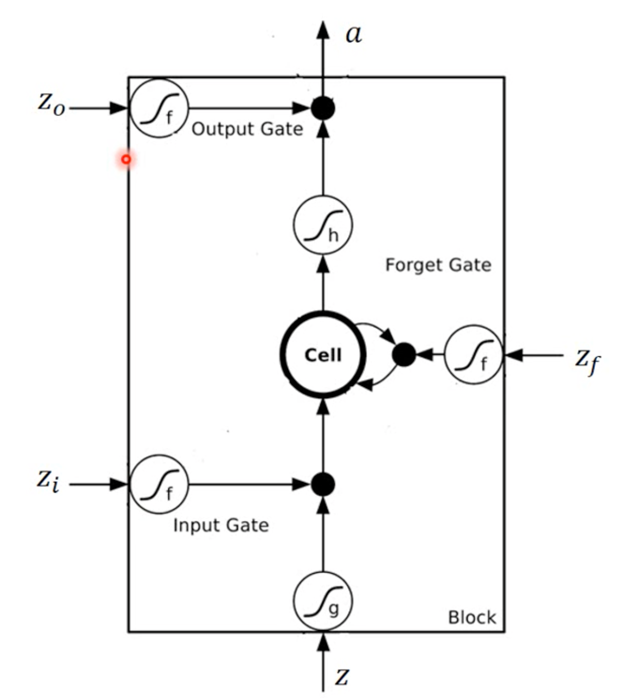
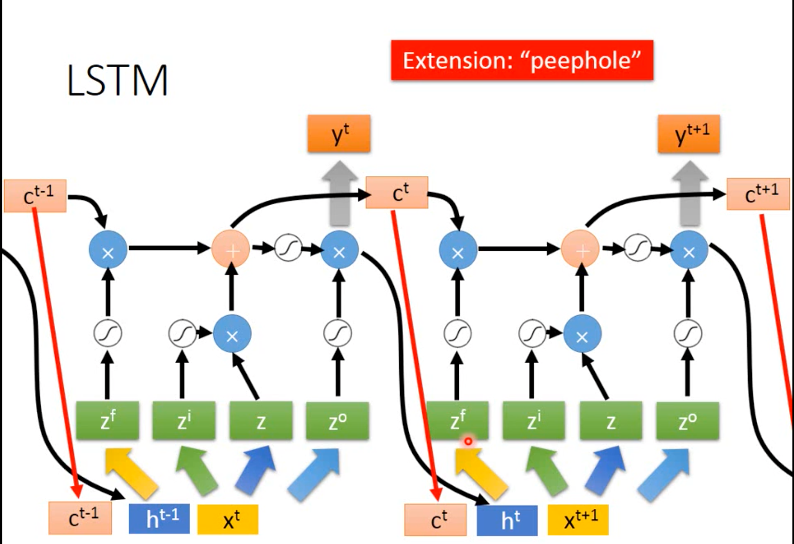

# RNN

用于解决序列问题。

## SimpleRNN结构

一个简单的循环网络如下图，它由输入层、一个隐藏层和一个输出层组成（左上为简化图，下边为详细图）：

其中：
- $X$ 是一个向量，它表示输入层的值；
- $S$ 是一个向量，它表示隐藏层的值，$S$ 的输出结构不仅仅取决于这个时刻的输入还取决于上一次输出，同时 $S$ 的输出会被记忆（memory）下来，用于下一次输出计算；
- $U$ 是输入层到隐藏层的权重矩阵；
- $O$ 是一个向量，它表示输出层的值；
- $V$ 是隐藏层到输出层的权重矩阵；
- $W$ 是隐藏层上一次输出作为这一次输入的权重矩阵； 

**Deep architecture**

上图的RNN只有一个隐藏层，当然它可以更深，如下图。

> 注意：RNN不同时刻是复用上图的结构。

**Bidirectional RNN**

上图的RNN只有一个方向，可以扩展到两个方向，这样观察范围会更广，如下图。

SimpleRNN具有记忆能力（通过cell保存结果，如方框内的东西），它将 $t_1$时刻的输入保存起来用于下一次预测，因为记忆能力，对于不同时刻的相同输入也会产生不同的输出。

## LSTM结构

> LSTMs are explicitly designed to avoid the long-term dependency problem. Remembering information for long periods of time is practically their default behavior, not something they struggle to learn!

相比于SimpleRNN结构中，每次都让新的输出覆盖旧的记忆，LSTM的结构元中加入很多Gate的单元来控制记忆，如下图。

其中：
- Forget Gate：控制那些记忆信息应该被遗忘的闸门，使用sigmoid激活函数，0表示完全关闭，1完全表示开启。
- Input Gate：控制那些新信息需要被记忆的闸门，使用sigmoid激活函数，0表示完全关闭，1表示完全开启。
- Output Gate：控制输出的闸门，使用sigmoid激活函数，0表示完全关闭，1表示完全开启。

实际的LSTM结构元：

LSTM整体结构：

参考链接：
- [Understanding LSTMs](https://colah.github.io/posts/2015-08-Understanding-LSTMs/)
- 李宏毅机器学习-RNN