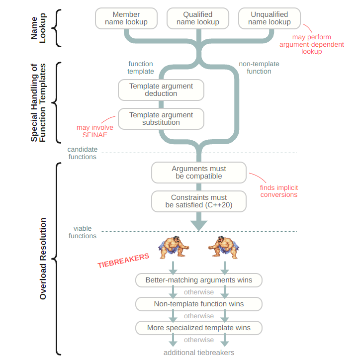

# C++服务器开发

## 计算机基础


### 计算机组成

#### 计算机中信息表示

信息在计算机中都是以二进制位保存的，而其含义取决于上下文（同样的二进制位在不同的上下文中可能有不同的含义），简言之：**信息=位+上下文**。

**启发**


对于`-8.25`如何在计算机中表示呢？最简单的二进制表示就是`-1000.01`。但是计算机无法保存符号的和小数点的。

因此目前面临的挑战有两点：
- 如何表示符号。
- 如何表示小数点。

符号的表示我们可以增加一个额外的二进制位，例如在二进制数最前面加一个符号位，0表示+，1表示-。在不考虑小数的情况下，这种表示方法足以应对整数的表示，这种方法就是原码的表示方法。但是原码的表示不利于计算，它需要额外的逻辑来判断符号，并且需要加减法两套运算设备。为了便于运算，引入了补码，补码运算不需要额外逻辑来判断符号，同时只需要一套加法设备就能完成加减法的运算。

小数点的表示有两种方式，一种是固定小数点的位置，这种数字称为定点数，另一种是不固定小数点的位置，这种数字称为浮点数：
- 对于纯整数，小数点固定在最低一位后（默认）。
- 对于纯小数，小数点固定在最高一位前（默认）。
- 对于整数+小数，小数点可以固定在某一位（规定）。


通常数的表示范围都是对称的，并且负数的范围会大1，原因在于0属于正数的表示范围。

对数字敏感一点：
- $2^{20} \approx 1000000$，即100万。
- $2^{30} \approx 1000000000$，即10亿。


参考链接：
- [什么是定点数？](https://zhuanlan.zhihu.com/p/338588296)
- [什么是浮点数？](https://zhuanlan.zhihu.com/p/339949186)
- [浅谈float和double](https://zhuanlan.zhihu.com/p/136245085)


### 数据结构与算法


#### 动态规划与贪心算法

> 动态规划原理

Q：什么问题适合使用动态规划？

A：适合使用动态规划求解三要素：
- 首先是一个最优化问题。
- 该最优化问题具有最优子结构。
- 该最优化问题具有重叠子问题。

> 最优子结构

最优子结构性质：原问题的最优解由相关子问题的最优解组合而成，而这些子问题可以**独立求解**（同一个原问题的一个子问题的解不影响另一个子问题的解）。

换个角度来看，我们所面临的困境就是：求解一个子问题时用到了某些资源，导致这些资源在求解其他子问题时不可用。

当某个问题满足最优子结构时，动态规划算法很可能适用（同样地，贪心算法也可能适用）。

Q：为什么需要满足最优子结构？

A：因为动态规划方法就是利用子问题的最优解来构造原问题的最优解（因此，构造原问题的最优解时必须小心考察所有用到的子问题）。


我们可以使用子问题的总数和每个子问题需要考察多少种选择这两个因素的乘积来粗略的分析动态规划算法的运行时间。


动态规划x部曲：
1. 定义递归函数解决的问题。
2. 做一次选择，产生一个或多个子问题。
3. 找出原问题与子问题之间的递推关系。
4. 初始化初始条件。


动态规划适合求解多步决策问题。


> 重叠子问题

重叠子问题性质：递归算法反复求解相同的子问题。

适合用动态规划算法求解的最优化问题应该具备的第二个性质是子问题空间必须足够“小”
，即问题的递归算法会反复地求解相同的子问题，而不是一直生成新的子问题。一般来讲，不同子问题的总数是输入规模的多项式函数为好。与之相对的，适合分治算法求解的问题通常在递归的每一步都产生全新的子问题。


**背包问题**


**股票买卖问题**


**钢条切割问题**


### 计算机网络

#### IP协议

IP协议的作用是用来定位一台主机的。

**IP地址的表示**


#### TCP协议

#### HTTP协议

#### WebSocket协议


## C++语言

C++重要blog：
- [important C++ blog](https://preshing.com/about/)

### C++基础

**野指针 vs 悬空指针**

A **wild pointer** is a pointer that has non been correctly initialized and therefore points to some random piece of memory. It is a serious error to have wild pointers.

A **dangling pointer** is a pointer that used to point to a valid address but now no longer does. There is nothing wrong with having a dangling pointer unless you try to access the memory location pointed at by that pointer. It is always best practise not to have or leave dangling pointers. 


预处理的结果称为**编译单元（translation unit）**。编译单元是编译器真正处理的内容，也是C++语言规则所描述的内容。


链接属性：
- 如果一个名字在其定义处之外的编译单元中也可以使用，我们称其具有**外部链接（external linkage）**。
- 如果一个名字只能在其定义所在的编译单元使用，我们称其具有**内部链接（internal linkage）**。
- 链接器看不到的名字，则为**无链接（no linkage）**。


#### C++函数调用解析过程

看一文：[How C++ Resolves a Function Call](https://preshing.com/20210315/how-cpp-resolves-a-function-call/)

加一图足矣：




### C++11/14/17/...新特性

#### 1. C++11已弃用特性

弃用（deprecate）并非彻底不能用，只是暗示程序员这些特性将来会从标准中移除，应该尽量避免使用。但是已弃用的特性仍然是标准库的一部分，并且出于兼容性的考虑大部分特性其实会永久保留。

- auto_ptr被弃用，应该使用unique_ptr。
- bool类型的++操作已被弃用。
- 如果一个类有析构函数，仍为其生成拷贝构造函数和拷贝赋值运算符的特性被弃用。
- C语言风格的类型转换被弃用，应该使用新式的类型转换。
- ...


#### 2. 自动类型推导

C++98只有一种类型推导机制：
- 函数模板类型推导。

C++11加入了两种新的类型推导机制，因此一共有三种类型推导机制：
- 函数模板类型推导。
- auto类型推导。
- decltype类型推导。

C++14则增加了auto和decltype的使用场景。


#### 3. 左值引用、右值引用、移动语义、完美转发


**std::move和std::forward**

std::move是无条件的将目标转换成右值，而std::forward则是有条件对目标左右值进行转换（因此需要将其原始类型作为类型参数传入）。


#### 4. 可调用对象（callable object）

C++11的可调用对象是指：
- 普通函数。
- 函数指针或引用。
- 函数对象：重载了operator()的具名类对象。
- lambda函数：重载了operator()的匿名类对象。

C++11的可调用对象如此丰富，如何统一？——使用`std::function`。

**std::function**

`std::function`是一个类模板，它代表函数签名相同的一类可调用对象（将函数签名相同的具体可调用对象如函数指针、函数对象、亦或者是lambda函数封装），可以看成是可调用对象的wrapper。

因此我们在使用`std::function`时需要指定函数的签名，此时`std::function`就代表了所指定函数签名的一切可调用对象，可以接受与所指定函数签名的一切可调用对象。

`std::function`虽然好用，但是只能接收所指定函数签名相同的一切可调用对象。为了弥补这一缺陷，我们可以使用`std::bind`。


**与std::bind完美联动**

`std::bind`是一个函数模板，功能就像是函数适配器，它接收一个可调用对象并生成一个新的可调用对象（`std::function`对象），新的可调用对象"适配了"原来可调用对象的参数列表。简而言之，使用`std::bind`可以提前绑定参数（或者改变参数位置），然后留下一些参数后续绑定，进而改变原可调用对象的调用方式。

联动举例：可以接收任意可调用对象。

```C++
template <typename F, typename... Args>
void foo(F&& f, Args&&... args) {
    std::function<decltype(f(args...))()> func= std::bind(std::forward(f), std::forward(args)...);
    func();
}
```


**lambda函数的实现原理**

lambda函数的实现实际上是通过重载函数调用符（"operator()"）类对象实现的。当我们定义一个lambda函数时，编译器会为我们生成一个匿名的类，这个类重载了函数调用符，并且将捕获的变量（值捕获或者引用捕获）作为自己的成员变量。


> 返回值类型是不作为函数重载的考虑因素的。


#### 5. 智能指针

C++11引入智能指针来防止资源泄露。

C++11有三种智能指针：
- unique_ptr
- shared_ptr
- weak_ptr


**unique_ptr实现**


**shared_ptr实现**


**weak_ptr实现**


**Tip：优先使用make_shared或make_unique来创建智能指针**

使用make_shared或者make_unique有两方面的好处：
- 效率更高
- 异常安全

我们创建一个智能指针时，有两种方式：

```C++
// 方式一
Widge* p = new Widgt;     // 1. 进行第一次动态分配
shared_ptr<Widge> sp(p);  // 2. 进行第二次动态分配（分配控制块）

```

方式一需要先new，后构造，如果在new和构造之间存在可能出现异常的行为，则可能造成资源泄露。而是用make_shared或者make_unique将一气呵成。


参考：[std::make_shared](https://blog.csdn.net/zhgeliang/article/details/81237053)


#### 异步编程


**std::future**


**std::async & std::package_task & std::promise**


### 惯用法

**1. RAII**

RAII是C++语言的一个十分重要的惯用法，它是"Resource Acquisition Is Initialization"的首字母简称，中文译为“资源获取即初始化”。意思是我们在获取资源时（例如，new一个对象时）将该资源作为其他对象的初始值进行初始化。

所谓资源就是一旦用了它，用完必须归还给系统，否则将导致系统资源耗尽，各种不好的事情都会发生。我们最常使用的资源就是动态内存，但其实内存只是你必须管理的众多资源之一。其他常见的资源还包括：文件描述符、互斥量、socket等。

尝试在任何情况下都确保资源释放是十分困难的，因为程序的执行流会因为异常而改变，亦或者会存在多条返回路径我们不能保证执行顺序。即便我们谨慎的编写程序确保其没有资源泄露，但一旦我们的程序开始接受维护就有可能导致新的执行路径的产生以及原本不抛异常的函数现在抛异常了。

为了使我们脱离苦海，C++使用RAII来解决资源泄露问题。RAII是一项简单又重要的技术——它利用C++对象生命期的概念来控制程序的资源（例如内存、文件句柄、网络连接等）。RAII技术就是将资源的生命期和对象的生命期绑定，这样就可以利用C++复杂老练的对象管理设施来管理资源。

RAII的两个关键思想是：
1. 获得资源后立刻放进管理对象（将资源和对象生命期绑定）。
2. 管理对象利用析构函数确保资源被释放（对象生命期结束时释放资源）。

:warning: 对于第1点我们应该以独立语句将newed对象置入管理对象（如智能指针）否则可能会造成内存泄露。


RAII简单的实现形式就是创建一个对象：其在构造函数中获取资源，而在析构函数中释放资源（智能指针就是RAII明显的实例）。

```c++
class Resource { /* ... */ }
class ResourceHandle {
public:
    explicit ResourceHandle(Resource* myResource)
        : myResource_(myResource) {}  // 获取资源
    ~ResourceHandle()
        { delete myresource_; }
    Resource* get()
        { return myResource_; }

private:
    Resouce* myResource_;
}

```

每一个RAII class的设计者都必须选择RAII对象的拷贝语义（拷贝构造和拷贝赋值），大多数时候你会选择以下两种可能：
- 禁止拷贝。
- 使用引用计数进行拷贝。


我们将资源放在RAII对象中，可以保证资源不会泄露，但是我们也应该提供对原始资源的访问（提供get方法），因为大部分API可能会直接操作原始资源。


作用：简化资源管理，避免资源泄露，同时提供对原始资源的访问，安全与便利性的统一。


**2. Pimpl**

Pimpl也是一个C++常用的惯用法，它是"Pointer to implement"的首字母简写，中文译为“指向实现的指针”。意思是通过指针指向实现。


作用：避免编译依赖，加速编译


**3. Copy and Swap**


### C++ design patterns


#### 简单工厂模式、抽象工厂、模板工厂


## 工具链


### 服务器管理相关

**SSH——Xshell**


**FTP**

### 编译链接调试相关

**gcc**

gcc指令常用参数：
- -c
- -E
- -s
- -Wall
- -g
- -o


**gdb调试**


gdb常用调试命令：
|命令名词|命令缩写|命令说明|
|-------|------|-------|
|run    |r     |运行程序|
|list   |l     |显示程序源代码|
|continue|c    |让暂停的程序继续运行|
|next   |n     |运行到下一行|
|print  | p    |打印变量或寄存器值|
|backtrace|  bt|查看当前线程的调用堆栈|
|frame  |f     |切换到当前调用线程的指定堆栈，通过堆栈序号指定|
|break  |b     |添加断点|
|tbreak |tb    |添加临时断点|
|delete |del   |删除断点|
|enable |enable|启用某个断点|
|disable|disable|禁用某个断点|  
|info   |info   |查看断点/线程等信息|
|watch  |watch |监视某个变量或内存地址的值是否发生变化|
|set args|     |设置程序启动命令行参数 |
|show args |    |查看设置的命令行参数|

### 构造跨平台project——CMake


## 多线程编程

**线程的执行不过就是一堆指令在操作着一堆数据。当多个线程操作共享数据时（两种关系：互斥和等待），线程之间发生交互，这时需要进行同步，否则由于现代计算机的设计优化可能出现不可确定的结果，从而导致错误的产生；如果多个线程仅操作自己私有数据（实际上很少可能），则就可以看成多个“单线程”的多线程，而由于现代计算机的设计保证了单线程执行的正确性，此时无需同步。由此可见，我们需要保护的是数据。**

- 「临界区」——访问和操作共享数据的代码段。

因此，在多线程编程中需要找出临界区，并对临界区进行同步。


**不同粒度的同步**

as-if-serial semantics: 编译器和处理器为了提高指令执行的吞吐量会做各种压榨性能的优化，但是不管如何优化都必须程序在单线程执行下的正确性，就好像（as-if）程序仍然是串行执行的（serial）。

编译器和处理器通常会做如下优化：
- 编译器或处理器对指令重排序，以尽可能提高指令执行的并行性（reorder）。这在单线程是没问题的，因为编译器或处理器对指令所作的重排序都是合理的，对于存在依赖的指令，编译器和处理器是不会重排序的，它们所作的重排序是不会影响程序单线程执行下的结果的。而在多线程是会存在问题的。首先我们需要清楚其他线程是如何感知某个线程指令执行顺序的，每个线程都是运行在不同的CPU上的，所以它们之间的通信就是通过共享内存，也即线程之间通过观察共享内存的值的变化来感知某个线程指令的执行顺序的，更进一步也即通过共享内存的写入顺序（内存顺序）来感知。
- 每个处理器都有自己私有的缓存。这在多线程会带来问题，不同线程位于不同处理器上，某个线程对共享内存的修改可能不会立即被另一个线程可见。而对某些后面的共享内存修改可能会立即被另一个线程可见


程序顺序不等于执行顺序（out-of-order execution）。
执行顺序不等于观察顺序（memory sequence reorder）。

观察顺序其实就是某个cpu的内存顺序。

在单线程中，执行顺序一定等于观察顺序，否则就无法保证单线程执行的结果的正确性。

有缓存一致性（未优化前）能保证执行顺序等于观察顺序（内存顺序）。
引入store-buffer会导致执行顺序不等于观察顺序，内存顺序乱序。


store-forward

内存屏障就是内存模型的保证。

key point:
- 每个线程的指令执行顺序由各自的CPU来控制，因而有独立的执行顺序，但因为它们共享同一个内存，而内存修改的顺序是全局的，我们可以以该全局顺序为参考，对所有线程进行同步。


因此，在多线程环境下，如果每个线程之间都互相独立，即没有共享数据，每个线程都访问（读和写）自己的私有数据，那么在as-if-serial semantics的保证之下，每个线程都能高效地得到正确的结果。但是如果线程之间不是互相独立的，即它们之间会共享数据，并且会对共享数据进行访问（读和写），那么就会带来一系列问题：
1. （竞争关系）由于多线程可能并行或并发的访问共享数据，但是访问共享数据的操作可能不是原子的，就会导致数据败坏（只写入一半，或者读到一半是修改的一半是未修改的）或者操作覆盖。
2. （依赖关系）由于编译器和处理器都是以单线程的视角看待所有线程的，因此它们可能会对某些内存访问进行乱序以提高性能，而这对于单线程来说是正确的，但对于多个存在依赖关系的线程说这可能会出错。


```c++
flag = false; // initial

// cpu 0   
x = 1024;     // store
flag = true;  // store

// cpu1
while(!flag);  // read
assert(x == 1024);  // read
```


```c++
void foo(void)
{
    a = 1;
    //smp_mb();
    b = 1;
}

void bar(void)
{
    while (b == 0) continue;
    assert(a == 1);
}


```


内存模型：
- 内存模型实际上就是每个CPU的内存顺序的规定（?）。
- 我为一个抽象的机器写一套抽象的程序，然后在不同的平台下让编程语言、编译器来生成合适的内存屏障。因此，便有了内存模型的概念，不同平台下的实现差异被统一的内存模型所隐藏，只要根据这个抽象的内存模型来编写程序就能得到正确的结果，这便是伟大的抽象。


学习内存模型是为了避免性能损耗更高的锁。

通过锁来同步。


mutex使并行串行化。

内存屏障的作用就是防止内存乱序。


  

### 原子操作

> 原子操作是其他同步方法的基石。

原子操作可以保证指令以原子的方式执行——执行过程不被打断。

原子整数操作最常见的用途就是实现计数器。


**原子性和顺序性的比较**

- 原子性确保的是指令在执行期间不被打断，要么全部执行完，要么根本不执行。
- 而顺序性确保即使两条或多条指令出现在独立的执行线程中，甚至独立的处理器上，它们本该的执行顺序依然保持与程序顺序一致。
- 原子操作只保证原子性并不能保证顺序性，顺序性通过屏障来保证。


### 锁

锁有多种多样的形式，而且加锁的粒度范围也各不相同——Linux自身实现了几种不同的锁机制。各种锁机制之间的区别主要在于：当锁已经被其他线程持有，因而不可用时的行为表现。

主要有两种行为表现：
- 自旋等待（spin）。
- 睡眠（sleep）。


**自旋锁（spinlock）**


**锁的实现原理**


**死锁问题**

死锁的产生需要一定的条件：
- 互斥条件。
- 请求和保持条件。如果线程发现需要占有的锁不可用时，则把之前占有的锁释放，则不会发生死锁（？？？）。
- 不可剥夺条件。
- 环路等待条件。


最简单的死锁例子就是「自死锁」：如果一个执行线程试图去获得一个自己已经拥有的锁，它将不得不等待锁被释放，但因为它正在忙着等待这个锁，所以自己永远也不会有机会释放锁，最终结果就是死锁。


同样道理，考虑有n个线程n把锁，如果每个线程都持有一把其他线程需要的锁，那么所有线程都将阻塞等待他们希望得到的锁重新可用，但是绝对没有一个线程会释放自己的锁，于是导致死锁。最常见的例子是有两个线程两把锁的死锁称为「ABBA死锁」。

预防死锁：
- 按顺序加锁，按逆序释放锁。

### 条件变量

条件变量的使用有几个注意点:
- 唤醒丢失：线程唤醒前，其他线程还没加入唤醒队列（两种情况）。
- 虚假唤醒：线程被唤醒，但是之前满足的条件现在已经不满足了。

为了防止唤醒丢失，我们需要：
1. 添加一个判断条件。
2. 调用wait时必须加锁。

为了防止虚假唤醒，我们需要：
1. 使用while而不是if来替代判断状态。
2. 调用signal时，最好加锁。


正确用法：

```C++
// 初始化
vector<int> vec;
pthread_mutex_t mtx = PTHREAD_MUTEX_INITIALIZER;
pthread_cond_t cond = PTHREAD_COND_INITIALIZER;

// 消费者
pthread_mutex_lock(&mtx);              // c1
while (vec.empty()) {                  // c2
    pthread_cond_wait(&cond, &mtx);    // c3
}
consume_data(vec);                        
pthread_mutex_unlock(&mtx);            // c4

// 生产者
pthread_mutex_lock(&mtx);              // p1
produce_data(vec);                     // p2
pthread_cond_signal(&cond);            // p3
pthread_mutex_unlock(&mtx);            // p4
```

将signal放在unlock前，可以保证代码可读性，以及提供一个可预测的调度行为。

### 应用——线程池

线程本质就是一个函数的执行，只是主线程的入口函数是main，而其他线程的入口函数就是需要执行的函数。

当该执行函数执行完后线程也就结束了，那么如何复用线程呢？为了复用线程我们需要让线程不断的循环执行调度函数，然后从任务队列中取出任务，如果没有任务则阻塞等待，当线程池不再使用后再停止循环。

因此线程池（ThreadPool）的组件包括以下内容：
- 任务队列存放要执行的函数（TaskQueue）。
- 工作线程（worker）。


### OTHER

ROB: Reorder Buffer.

the process of an instruction leaving the ROB (in order) is called commit – an instruction commits only if it and all instructions before it have completed successfully (without an exception).

precise exception: An exception for which the pipeline can be stopped, so instructions that preceded the faulting instruction can complete, and subsequent instructions can be flushed and redispatched after exception handling has completed.


### Go on reading

- [Parallel Computer Architecture and Programming (CMU 15-418/618)](http://www.cs.cmu.edu/~418/resources.html)
- [线程如果切换到其它的core上运行,如何保证缓存一致性？](https://www.zhihu.com/question/334107371/answer/757179110)


## 网络编程

### Socket编程

必须掌握的常用的socket API，如下表：
|函数名词|函数简单描述|参数说明|返回值说明|附加说明|
|-------|----------|------|--------|-------|
|socket()| 创建某种类型的socket |参数需要指定协议族和地址族|返回一个监听socket文件描述符||
|bind()| 将socket绑定到（ip，端口号）二元组上|参数指定待绑定socket以及待绑定的ip地址和端口号|成功返回0，失败返回-1||
|listen()|使socket进入listen状态|参数指定待监听的socket以及连接请求等待队列长度|成功返回0，失败返回-1|
|accept()|服务器端尝试接受一个连接||成功时返回创建的socket文件描述符，失败返回-1|由于服务端socket是用于监听的，不能用于与用户进行数据传输的（想一想，如果服务端socket用来传输数据，谁来监听客户端的连接请求？），所以该函数会创建一个新的socket与用户进行数据传输。|
|connect()|客户端向服务端发起连接|参数指定要连接的目的地址信息|成功返回0，失败返回-1|谁调用connect谁就是客户端。|
|send()|通过socket发送数据|参数指定||
|recv()|通过socket接受数据|||
|select()|监听一组socket上的读写和异常事件|||
|gethostbyname()|通过域名获取机器地址|||
|close()|关闭一个socket，回收资源|||
|shutdown()|半关闭socket的收或发通道|||
|setsockopt()|设置socket选项|||
|getsockopt()|获取socket选项|||

> 不要单纯地记忆这些函数的参数，而是掌握每一个函数的细节和重难点。


#### IO复用

**select**

select系统调用的原型如下：
```C++
#include <sys/select.h>
int select(int nfds, fd_set* readfds, fd_set* writefds, fd_set* exceptfds,
           struct timeval* timeout);

// ndf参数指定被监听的文件描述符的总数，通常设置为select监听的所有文件描述符中的最大值加1，因为文件描述符从0开始计数。
// readfds、writefds、exceptfds参数分别指向可读、可写、异常事件对应的文件描述符集合。应用程序通过这3个参数传入自己感兴趣的文件描述符。select调用返回后，内核将修改它们来通知应用程序哪些文件描述符已经就绪。
// timeout参数用来设置select函数的超时时间。
```

该系统调用存在以下缺点：
- 每次都要重新置位fd_set然后将其从用户空间拷贝到内核空间（拷贝开销）。
- 每次都要遍历整个数组才能获取所有事件（遍历开销）。

**poll**

poll的系统调用原型如下：
```C++
#include <poll.h>
int poll(struct pollfd* fds, nfds_t nfds, int timeout);

// fds参数是一个pollfd结构类型的数组，它指定所有我们感兴趣的文件描述符上发生的可读、可写和异常等事件。
// nfds

```


**epoll**

epoll通过一组函数来完成工作：
- epoll_create
- epoll_ctl
- epoll_wait

epoll系统调用原型如下：
```C++
#include <sys/epoll.h>
int epoll_create(int size);
```


## 高性能服务器开发


### Reactor & Proactor

四个基本概念：
- 阻塞IO：用户执行read，线程会被阻塞，一直等到内核把数据准备好，并把数据从内核缓冲区拷贝到应用程序缓冲区中，当拷贝过程完成，read才会返回。
- 非阻塞IO：非阻塞的read请求在数据未准备好的情况下立即返回，可以继续往下执行，此时应用程序不断轮询内核，直到数据准备好，内核将数据拷贝到应用程序区，read调用才可以获取到结果（注意，当read调用发现数据已经准备好后则需要等待内核将数据拷贝到用户程序区，这个过程是需要等待的）。
- 同步IO：其中阻塞IO和非阻塞IO都可以看做是同步IO，因为在调用时，都要等待内核把数据从内核空间拷贝到用户空间中。
- 异步IO：当我们发起异步的read操作后就立即返回，当数据准备好时内核自动将数据从内核空间拷贝到用户空间，然后通知用户程序。


有了以上基本概念，我们再来理解Reactor和Proactor模式：
- Reactor是非阻塞同步网络模式，感知的是事件就绪可读写事件。**在每次感知到有事件发生时，就需要应用程序主动调用read来完成数据的读取**，也就是要应用程序主动将socket接收缓存区中的数据读到应用进程内存中，该过程是同步的，读取完数据后应用程序才能处理数据。
- Proactor是异步网络模式，感知的是已完成的读写事件。在发起异步读写请求时，需要传入数据缓存区的地址等各种信息以便内核能够有足够的信息来帮我们代劳，**内核完成读写工作后，就会通过回调通知应用程序直接处理数据。**

无论是Reactor，还是Proactor都是一种基于事件分发的网络编程模式，区别在于Reactor模式是基于就绪的IO事件，而Proactor模式是基于已完成IO事件。


## 其他

### 递归转非递归

- 其中stack是用来维护执行顺序的，由于我们不可能暂停函数的执行，因此我们会模仿系统调用函数的过程，将调用链上的函数压栈，然后直接执行最开始需要执行的函数，然后又模仿系统调用函数的过程进行压栈，执行下一个要执行的函数，依次执行，直到栈空。
- top则表示要执行对应的函数。
- pop则表示对应的函数执行结束，后续不会再回到该函数。


### 贪心算法正确性证明

贪心算法正确性证明：
- 证明其错误只要能举出一个反例就就行。
- 证明其正确，则一般通过归纳法证明某个问题规模为n的命题：算法执行到第k步，做了k次贪心选择，选择了$a_1$, $a_2$, ... ,$a_k$，那么存在最优解A包含$a_1$，$a_2$, ... ,$a_k$（k至多等于n，只要此定理成立，算法至多做n次选择后得到最优解）。
  - 归纳基础：当k=1时，证明存在最优解A中包含贪心选择 $a_1$。
  - 归纳步骤：当命题对k成立时，对k+1也成立。
  


## 代码规范和工程实践

### 通用代码规范

**命名规则**：
- 文件命名：`my_file.h`，下划线连接具体描述性名字。
- 类型命名：`MyType`，采用大驼峰命名法。
- 变量命名：
  - 普通变量：`table_name`，下划线连接具体描述性名字。
  - 类成员变量：`table_name_`，下划线连接具体描述性名字并以下划线结尾。
  - 常量：`kTabelName`
- 函数命名：`DoSomething()`，采用大驼峰命名法并且使用动宾结构。

**注释**：
- 统一采用//。
- 文件开头要有版权注释。
- 每个类都要注释，描述类的功能和用法。
- 函数声明处的注释描述函数的功能，函数定义处的注释描述函数的实现。


**函数** 
```C++
// 形参的第一种写法，不直接换行
std::vector<std::string> SplitString(StringPiece input,
                                     StringPiece separators,
                                     WhitespaceHandling whitespace,
                                     SplitResult result_type) {
  return internal::SplitStringT<std::string>(input, separators, whitespace,
                                             result_type); // 调用函数时的第一种写法，不直接换行
}

// 形参的第二种写法，直接换行空四格
std::vector<StringPiece16> SplitStringPieceUsingSubstr(
    StringPiece16 input,
    StringPiece16 delimiter,
    WhitespaceHandling whitespace,
    SplitResult result_type) {
  std::vector<StringPiece16> result;
  return internal::SplitStringUsingSubstrT<StringPiece16>(
      input, delimiter, whitespace, result_type); // 调用函数的第二种写法，直接换行空四格
}

```

**类**

```C++

```


### 如何设计一个类？

**准则1**：确定类是否是值类。


**准则2**：


类编写规范（参考Google）：
- 访问控制符先public后private。


### 工程代码如何组织？

CMAKE


### 如何编写头文件？

**准则1**：头文件应该自包含（self-contained），即用户只需要包含该头文件就足够了，不需要额外包含其他头文件。


**准则2**：头文件应该包含文件保护符，防止文件的多次包含。


**准则3**： 绝对不要在头文件中使用using指令。


### 如何编写实现文件？

**准则1**：必须包含定义了该实现文件的接口的头文件，作用是为了编译器做早期的一致性检查。

**准则2**：绝对不要在#include指令之前使用using声明或using指令。


