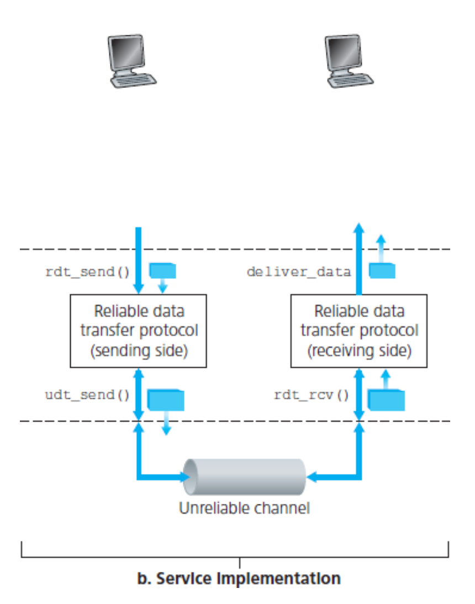
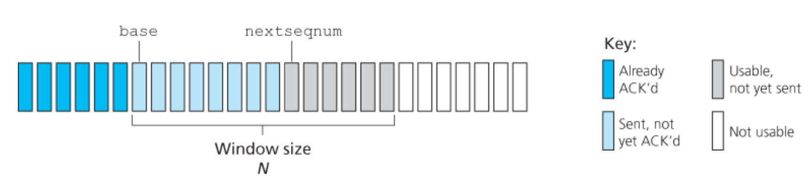
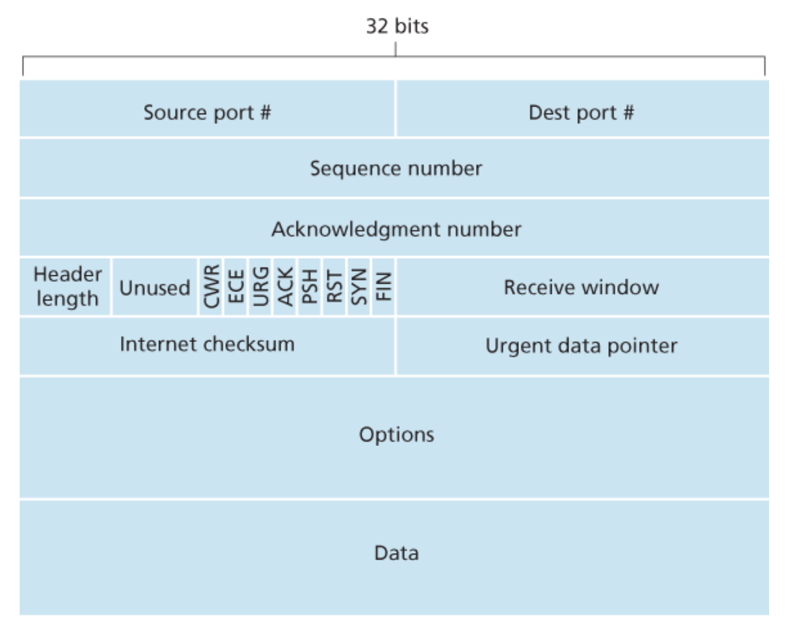
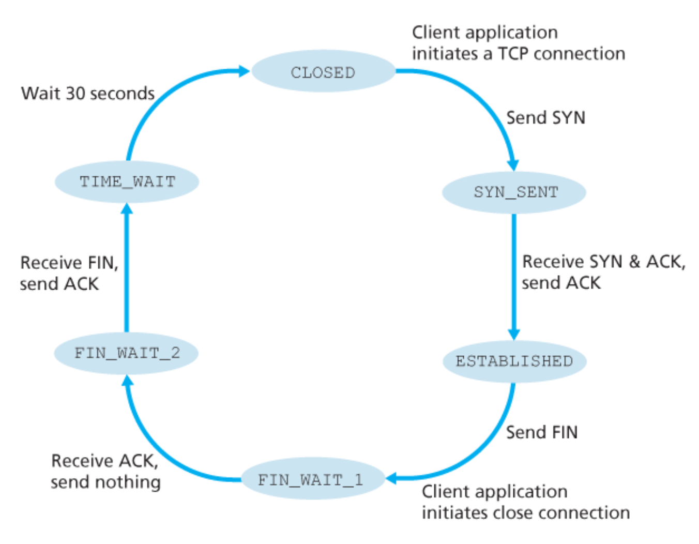
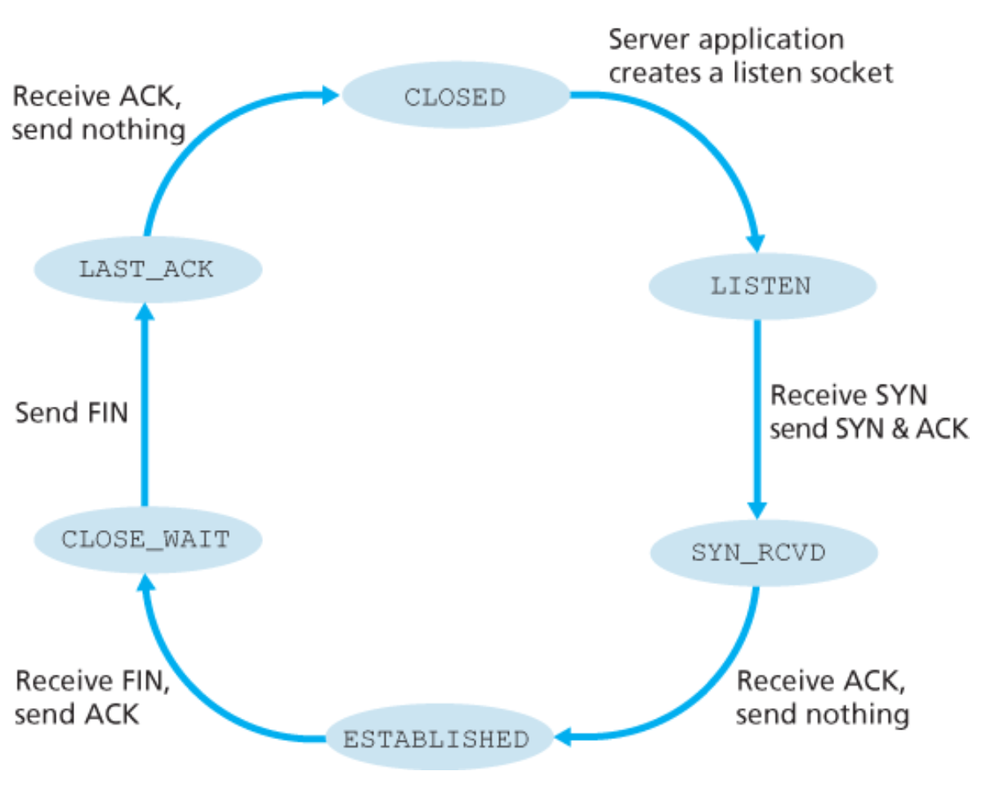
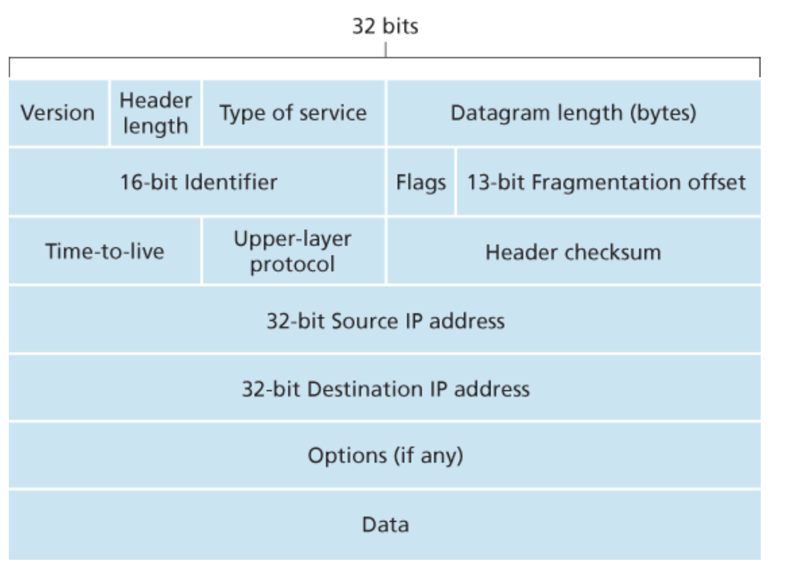

# TCP_IP网络基础知识

什么是协议

一个协议定义了在两个或多个通信实体之间交换报文的格式次序，以及报文发送或接收一条报文或其他事件所采取的动作。

由以上定义可以知道协议规定一下几部分：
- 报文的语法格式。
- 报文的时序。
- 报文的动作。

因特网广泛的使用了协议。不同的协议用于完成不同的通信任务。由于完成的通信任务不同，因此协议的复杂度也不相同。

因特网的协议栈由五个层次组成（自顶向下）：
- 应用层
- 传输层
- 网络层
- 数据链路层
- 物理层

## 应用层

### HTTP

### STMP

### DNS——Domain Name System

The DNS is:
1. a distributed database implemented in a hierarchy of DNS servers.
2. an application-layer protocol that allow hosts to query the distributed databse.

DNS protocol runs over UDP and uses port 53.

DNS除了提供主机名到IP地址的转换外还提供以下服务：
- 主机别名（Host aliasing）。拥有复杂主机名的主机可以同时拥有一个或者多个别名。应用程序可以向DNS发送别名来获取主机的规范主机名和IP地址。
- 邮件服务器别名（Mail server aliasing）。
- 负载分配。

#### DNS协议工作概览

为了解决以上问题，DNS没有采用单机的方式，而是采用了大量以层次结构组织的分布式服务器的方式。

不像单机那样存储所有的映射，而是将所有的映射分散存储在所有DNS服务器中。

#### DNS报文格式

DNS只有两种报文，即DNS请求报文和DNS应答报文，并且它们使用同样的报文格式。

每个DNS应答报文携带一个或多个资源记录。

一个资源记录（resource record）是一个四元组：
- `(Name, Value, Type, TTL)`

其中`TTL（Time-To-Live）`表示该资源记录有效时间，它决定了该记录什么时候应该从cache中清除。而`Name`和`Value`中根据`Type`不同有不同的含义：
- 如果`Type=A`，则`Name`表示主机名，而`Value`表示该主机名对应的IP地址。因此一个`Type=A`的资源记录提供主机名到IP地址的映射。
- 如果`Type=NS`，则`Name`表示一个域，而`Value`表示知道权威DNS服务器的主机名。因此这种资源记录用于
- 如果`Type=CNAME`，则`Value`是主机名别名`Name`的规范主机名。因此这种记录主要用于通过由主机名别名获得其规范主机名。
- 如果`Type=MX`，则是`Value`是邮件服务器别名`Name`对应的规范主机名。

为什么说DNS是应用层协议？
- 采用客户-服务器的通信模式。
- 依赖底层的端到端的传输协议来传输DNS报文。

### 作业

#### Review

**R. 为什么HTTP，SMTP和POP3使用TCP而不是UDP？**

## 传输层

本章内容结构：
1. 讨论传输层和网络层之间的联系。
2. 讨论如何在不可靠信道（数据可能损坏或丢失）实现可靠通信。
3. 讨论拥塞控制。

### 传输层与网络层的关系

传输层协议给运行在不同主机上应用进程提供逻辑通信。

逻辑通信是指从应用程序的视角来看通信双方好像直接相连，可以直接进行端对端的通信，但实际上不是，因此称为"逻辑上"。

### 多路复用和多路分解

传输层通过多路复用和多路分解，将网络层提供的host-to-host的递送服务扩展成process-to-process的交付服务。

#### what？

在目的主机，传输层从仅次于它之下的网络层中接收segments。传输层有责任将这些segments交付给对应的应用进程。而主机上通常运行着许多应用进程，因此当主机接收到segment时，传输层应该指挥segment的交付以便将其发给对应的应用进程。

另外我们知道应用进程使用`socket`进行网络数据传输，即：
- 发送数据时，我们将数据写入到`socket`。
- 接收数据时，我们从`socket`从读取数据。

因此，当接收端主机接收到数据时，接收端传输层实际上将数据交付到对应的`socket`（而不是直观理解的进程）。而对于接收端主机在任何时间都可能存在多个`socket`，因此传输层要精准交付，每个`socket`必须有唯一的标识（对于UDP socket和TCP socket的标识信息不同）。

为了接收方能够精准交付，我们需要在segment中包含特定的域用来指明该segment是要交付给哪个`socket`。于是当接收方收到segment时，就可以解析这些域来实现精准交付，这个解析过程就是**多路分解**，他将segment交付到正确的`socket`。而一台主机上有多个

#### how？

从上面看来，我们知道传输层多路复用实现需要：
1. `socket`有唯一的标识。
2. 每个segment包含特定的域来指明其需要交付的`socket`。

**无连接的多路复用和多路分解**

对于UDP `socket`，其完全由一个二元组（目的IP地址，目的端口号）唯一标识。并在UDP segment中包含这两个域。
- 对于两个segment，如果其有不同的源IP地址或源端口号（或两者都不同），但是其目的IP地址和目的端口号相同，则这两个segment将交付给同一个`socket`。

**有连接的多路复用和多路分解**

> 对于有连接的通信方式是一对一的。

对于TCP `socket`，其完全由一个四元组（源IP地址，源端口号，目的IP地址，目的端口号 ）唯一标识，并在TCP segment中包含相关的域。
- 不同于UDP，当两个TCP segments的源IP地址或源端口号不同时将会交付给不同的`socket`（例外，不同客户端发起连接请求的segment可能会发给同一个服务器的监听`socket`）。

安全问题——端口扫描

端口扫描，顾名思义，就是逐个对一段端口或指定的端口进行扫描。通过扫描结果可以知道一台计算机上都提供了哪些服务，然后就可以通过所提供的这些服务的己知漏洞就可进行攻击。其原理是当一个主机向远端一个服务器的某一个端口提出建立一个连接的请求，如果对方有此项服务，就会应答，如果对方未安装此项服务时，即使你向相应的端口发出请求，对方仍无应答，利用这个原理，如果对所有熟知端口或自己选定的某个范围内的熟知端口分别建立连接，并记录下远端服务器所给予的应答，通过查看一记录就可以知道目标服务器上都安装了哪些服务，这就是端口扫描，通过端口扫描，就可以搜集到很多关于目标主机的各种很有参考价值的信息。例如，对方是否提供FTP服务、WWW服务或其它服务。

UDP报文结构

UDP报文头部信息只有四个域，每个域占用两个字节：
- 源端口。
- 目的端口。
- 报文长度。指明UDP报文的长度（头部+数据）。
- 校验和。

### 构建一个可靠数据传输协议

我们希望给上层提供如下图这样的服务抽象：即上层在一个可靠信道中传输数据。其中可靠信道指传输的数据不会损坏（如比特翻转）或者丢失，并且所有数据都将按序发送。

而实际上，我们的信道是不可靠的，我们的实际模型如下图。

而在不可靠信道上实现可靠信道的服务抽象就是通过可靠数据传输协议完成。

目前构建的协议存在对使用场景的如下假设：
1. 底层信道传输数据包时，数据包可能会损坏（如0变1，1变0）或丢失，但是不会乱序到达。
2. 目前只考虑单向传输。

在该假设上，我们将一步一步构建一个健壮的协议。

**完全可靠的信道——rdt1.0**

首先我们考虑最简单的情形，那就是底层信道是完全可靠的，我们为其设计一个可靠数据传输协议称为`rdt1.0`。

`rdt1.0`的有限状态机：

解释：
- 由于底层信道完全可靠，因此发送方只需要将数据包发送出去，就能继续发送下一个数据包，无需接收方的任何反馈，因为不会发生任何错误。
- 由于底层信道完全可靠，因此接受方接收到数据包，就能继续接收下一个数据包。
- 注意，这里还有一个假设：接收方接收数据的速度和发送方发送速度一样快。

**可能存在错误比特的信道——rdt2.0**

一个更加接近现实的底层信道模型是信道中的数据包可能存在损坏的比特。

在开发出一个适用于这种信道的可靠传输协议前，我们先考虑下人们是如何处理这类情形的。回想一下你在手机上发一段语音转文字的信息时的情形，首先你对着手机一顿balabala，然后手机上的语音采集器将对你的语音进行读取分析转成文字，如果语音采集器无法分析出你的语音则会让你“重复”，如果能够分析出则提示你“成功”并转换成文字。这种控制信息能够使接收方通知发送方接收数据的情况（接收成功或接收数据有错误请重复）。基于这种重传机制的协议称为ARQ（自动请求重传）协议。

从根本上讲，ARQ协议需要三种额外的能力来解决可能存在的错误比特：
- 错误检测（Error detection）。首先需要能检测出错误的数据包，错误检测可以使用在UDP中使用的校验和（checksum）来检测。该技术只需要额外的若干比特即可。
- 接收者反馈（Receiver feedback）。当接收方接收到错误的数据包时，接收方需要反馈给发送方，不然发送方将无从得知。接收方使用ACK表示数据包正确接收，NCK表示数据包损坏，由于只需要表示两个状态，因此只需要一个比特的信息即可表示，如0表示NCK，1表示ACK。
- 重传（Retransmission）。发送方接收到接收方的反馈后如果需要重传，则重传。

`rdt2.0`也可以称为停止等待协议。

`rdt2.0`看起来好像可以正常工作了，但它其实存在一个致命的缺陷。因为这个协议能正常工作的前提是ACK和NCK数据包不会损坏。但我们知道这是不成立的。

因此我们必须解决当ACK和NCK数据包损坏时该如何处理的问题，**当ACK和NCK数据包损坏时，发送方将无法知道接收方是否接收到了正确的数据**。为了解决这个问题，我们首先需要给ACK和NCK数据包加上校验和以检测其数据是否损坏。接在再来处理后续的问题，在这里有三种可能的解决方案：
1. 第一种解决方案则是当发送方收到损坏的ACK或NCK包时，这时发送方将发送另一种类型的数据包，功能相当于询问“你在说什么？”。当接收方收到这种类型数据包时就知道ACK或NCK损坏了，于是接收方就可以重传。但如果发送方的新型数据包（“你在说什么？”）又发生了损坏，而此时接收方无法辨别发送方是发送新的数据包还是新型数据包（“你在说什么？”），于是接收方也只能发送新型数据包（“你在说什么？”）给发送方，显示发送方等待接收的是重传的ACK或NCK，却反而接收到了新型数据包（“你在说什么”），显示这对于发送方来说不知道是什么，它只能重复发送新型数据包（“你在说什么？”），于是乎陷入无限循环。可见这种方法是不可取的。
2. 第二种解决方案则是添加足够多的校验和比特以便能够在发送错误时不仅仅能够检测到还能将其修正。这将能够直接解决这类只会损坏数据包而不会丢失数据包的信道问题。
3. 第三种解决方案则是当发送方接收到数据损坏的ACK或NCK包时，直接重新发送当前数据包。这种方法十分简单，**但引入了重复包（duplicate packet）问题。这个问题的主要难点在于接收方不知道自己发送的ACK或NCK是否被发送方正确接收，因此无法确定该重复包是一个发送方重传的包还是一个新的包。**

对于第三种解决方案，其解决手段十分简单，但引入了新的问题。解决这个新问题的方法是给每个数据包编号。在每个数据包中包含一个新的域存放序列号（sequence number），于是接收方只需要查看序列号来区分是重传包还是新包。对于`rdt2.0`协议，一个比特的序列号就足够了（即0到1），因为这将使接收方知道是重传之前的包（序列号和之前发送的包的序号相同）还是一个新的数据包（序列号变化了，以模2运算向前）。

> 发送方的数据包编号是为了接收方能够区分是重传包还是新包。

**存在数据包丢失和数据包损坏的信道——rdt3.0**

**流水线可靠数据传输协议**

- GBN，回退N步协议。
- SR，选择重传协议。

### 面向连接传输——TCP

我们在上面已经讨论了构造可靠数据传输的基础法则。现在来看目前互联网使用的传输层协议TCP，它是面向连接的，具有可靠传输的协议。

**面向连接**

**TCP报文结构**

如下图，TCP报文包含头部域和数据域，数据域包含应用进程的数据，其最大长度由MSS限制。当使用TCP发送大文件时（大小超过MSS），将会进行拆包进行传送。

头部包含以下内容：
- 16位源端口号和目的端口号。用于多路复用和多路分解。
- 16位校验和。用于差错检测。
- 32位序列号和32位确认号。用于实现可靠传输。
- 16位的接收窗口。用于实现流量控制，指明接收方可以接收字节数，接收能力。
- 4位的头部长度。指出TCP报文头部的长度，单位为32bit。TCP报文段之所以可变是因为option域的原因，不过通常option域为空，因此TCP头部的大小通常为20字节。
- 可选的可变长度的option域。
- 6位的标志域。
  - ACK，用于指示确认号域是否有效。
  - RST，用于关闭异常连接。
  - SYN，用于建立连接。
  - FIN，用于关闭连接。
  - PSH，用于指示接收方应该尽快将该报文段传给上层。
  - URG，用于指示发送方将该报文段中的某些数据标记为"紧急"。这个紧急数据的最后一个字节由urgent data pointer指示。当存在紧急数据时，TCP必须通知接收方并将指向紧急数据的尾指针传递给接收方的上层（实际上，很少用）。

> :warning:TCP头部不包含数据长度，只有头部长度，不过可以隐含计算。

**TCP的可靠传输**

使用网络层服务进行数据传输是不可靠的，可能出现以下情形：
- （丢失）数据报可能会在路由器缓存溢出，导致路由器直接丢弃该数据包，进而导致数据包丢失。
- （乱序）数据报由于网络情况可能会乱序到达。
- （差错）数据报中的比特可能会出现差错。

而TCP使用网络层的服务来进行数据传输，因此也会遇到同样的问题。 

*序列号seq与确认号ack*

TCP把上层希望传送的数据视作无结构的、但有序的字节流。TCP使用序列号给每一个数据字节编号来反映这一点。每一个报文的序号为发送数据的第一个字节编号。

接收方作为反馈，通过确认号来告诉发送方其接收情况。

*超时重传*

TCP使用超时重传机制来解决包丢失的问题。

超时重传的最显然的问题就是：重传的时间间隔是多少？

很显然，时间间隔应该大于往返时间RTT——发送方从数据发送到接收到ACK时间长度。否则，将会造成不必要的重传（因为包没有丢失，只是还没到达）。

*流量控制*

TCP连接的每一方都有一个用于接收对方数据的接收缓存区（recieve buffer）。当对方有数据发送过来时，如果数据没有差错且有序则接收方会把数据放到该接收缓存区等待接收方应用程序读取（如调用`read`）。一旦有有效的发送方数据到达时就会放在该接收缓存区，而该接收缓冲区大小有限的，如果接收方读取数据的速度慢于发送方的发送速率，则会导致缓存区溢出，这将导致包的丢失。为了保证可靠传输，TCP提供了流量控制来保证发送方不会导致接收方缓存溢出。

流量控制相当于一个速度匹配服务——匹配发送方发送数据的速率和接收方接收数据的速率。

TCP通过在发送方维护一个接收窗口（recieve window）变量来提供流量控制。由于TCP是全双工的，因此TCP连接双方都维持一个独立的接收窗口。

> 注意和拥塞控制所区别。

TCP only acknowledges bytes up to the first missing byte in the stream, TCP is said to provide cumulative acknowledgments.

**TCP连接管理**

对于一个TCP连接，

TIME_WAIT状态使得TCP client可以重发最后的ACK以防ACK丢失。

## 补充：WireShark抓包工具

WireShark界面包括五个组成部分：
- 命令菜单（command menu）。包括文件和捕获菜单，可以通过文件菜单保存捕获的数据或打开一个包含捕获数据的文件；捕获菜单可以控制捕获的开始和结束。
- 显示过滤说明（display filter specification）。可以输入协议名称或者其他信息用来过滤显示的包信息。
- 包列表窗口（packet-listing window）。以列表的方式显示捕获到的包，每行对应一个包，包括（包序号、时间、源地址、目的地址、使用协议、协议长度、以及该协议特定的信息）。点击每个显示栏可以进行排序。
- 包头详情窗口（packet-header details window）。显示在包列表窗口中选中的包的包头详细信息。
- 包的所有内容窗口（packet content window）。以十六进制和ASCII的形式显示被选中包的所有数据。

## 网络层

### IP协议

- 版本号。
- 头部长度。
- 服务类型。
- 数据报长度。
- 16位标识符，是否分片以及13位的分片偏移。这三个域用于IP分片。
- TTL。
- 上层协议。
- 头部校验和。
- 32位源/目的IP地址。
- 可选。
- 数据域。在大多数情况下，数据域存放的是TCP或UDP报文段。不过数据域也可以存放其他类型的数据，例如ICMP信息。

