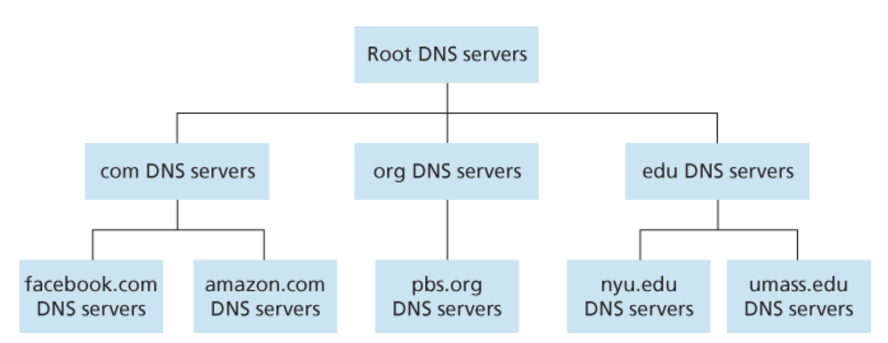

# TCP_IP网络基础知识

什么是协议

一个协议定义了在两个或多个通信实体之间交换报文的格式次序，以及报文发送或接收一条报文或其他事件所采取的动作。

由以上定义可以知道协议规定一下几部分：
- 报文的语法格式。
- 报文的时序。
- 报文的动作。

因特网广泛的使用了协议。不同的协议用于完成不同的通信任务。由于完成的通信任务不同，因此协议的复杂度也不相同。

因特网的协议栈由五个层次组成（自顶向下）：
- 应用层
- 传输层
- 网络层
- 数据链路层
- 物理层

## 应用层

### HTTP

### STMP

### DNS——Domain Name System

The DNS is:
1. a distributed database implemented in a hierarchy of DNS servers.
2. an application-layer protocol that allow hosts to query the distributed databse.

DNS protocol runs over UDP and uses port 53.

DNS除了提供主机名到IP地址的转换外还提供以下服务：
- 主机别名（Host aliasing）。拥有复杂主机名的主机可以同时拥有一个或者多个别名。应用程序可以向DNS发送别名来获取主机的规范主机名和IP地址。
- 邮件服务器别名（Mail server aliasing）。
- 负载分配。

#### DNS协议工作概览

为了解决以上问题，DNS没有采用单机的方式，而是采用了大量以层次结构组织的分布式服务器的方式。

不像单机那样存储所有的映射，而是将所有的映射分散存储在所有DNS服务器中。

#### DNS报文格式

DNS只有两种报文，即DNS请求报文和DNS应答报文，并且它们使用同样的报文格式。

每个DNS应答报文携带一个或多个资源记录。

一个资源记录（resource record）是一个四元组：
- `(Name, Value, Type, TTL)`

其中`TTL（Time-To-Live）`表示该资源记录有效时间，它决定了该记录什么时候应该从cache中清除。而`Name`和`Value`中根据`Type`不同有不同的含义：
- 如果`Type=A`，则`Name`表示主机名，而`Value`表示该主机名对应的IP地址。因此一个`Type=A`的资源记录提供主机名到IP地址的映射。
- 如果`Type=NS`，则`Name`表示一个域，而`Value`表示知道权威DNS服务器的主机名。因此这种资源记录用于
- 如果`Type=CNAME`，则`Value`是主机名别名`Name`的规范主机名。因此这种记录主要用于通过由主机名别名获得其规范主机名。
- 如果`Type=MX`，则是`Value`是邮件服务器别名`Name`对应的规范主机名。

为什么说DNS是应用层协议？
- 采用客户-服务器的通信模式。
- 依赖底层的端到端的传输协议来传输DNS报文。

### 作业

#### Review

**R. 为什么HTTP，SMTP和POP3使用TCP而不是UDP？**

## 传输层

### 构建一个可靠数据传输协议

目前构建的协议存在对使用场景的如下假设：
1. 底层信道传输数据包时，数据包可能会损坏（如0变1，1变0），但是不会乱序到达。
2. 目前只考虑单向传输。

我们将一步一步构建一个健壮的协议。

**完全可靠的信道——rdt1.0**

首先我们考虑最简单的情形，那就是底层信道是完全可靠的，我们为其设计一个可靠数据传输协议称为`rdt1.0`。

`rdt1.0`的有限状态机：

解释：
- 由于底层信道完全可靠，因此发送方只需要将数据包发送出去，就能继续发送下一个数据包，无需接收方的任何反馈，因为不会发生任何错误。
- 由于底层信道完全可靠，因此接受方接收到数据包，就能继续接收下一个数据包。
- 注意，这里还有一个假设：接收方接收数据的速度和发送方发送速度一样快。

**可能存在错误比特的信道——rdt2.0**

一个更加接近现实的底层信道模型是信道中的数据包可以存在损坏的比特。

在开发出一个适用于这种信道的可靠传输协议前，我们先考虑下人们是如何处理这类情形的。回想一下你在手机上发一段语音转文字的信息时的情形，首先你对着手机一顿balabala，然后手机上的语音采集器将对你的语音进行读取分析转成文字，如果语音采集器无法分析出你的语音则会让你“重复”，如果能够分析出则提示你“成功”并转换成文字。这种控制信息能够使接收方通知发送方接收数据的情况（接收成功或接收数据有错误请重复）。基于这种重传机制的协议称为ARQ（自动请求重传）协议。

从根本上讲，ARQ协议需要三种额外的能力来解决可能存在的错误比特：
- 错误检测（Error detection）。错误检测可以使用在UDP中使用的校验和（checksum）来检测。该技术只需要额外的若干比特即可。
- 接收者反馈（Receiver feedback）。发送者只有通过接收者的反馈才能知道发送情况。
- 重传（Retransmission）。接收方接受到错误数据包时，发送方要重传该数据包。

`rdt2.0`也可以称为停止等待协议。

`rdt2.0`看起来好像可以正常工作了，但它其实存在一个致命的缺陷。因为这个协议能正常工作的前提是ACK和NCK数据包不会损坏。但我们知道这是不成立的。

因此我们必须解决当ACK和NCK数据包损坏时该如何处理的问题，当ACK和NCK数据包损坏时，发送方将无法知道接收方是否接收到了正确的数据。为了解决这个问题，我们首先需要给ACK和NCK数据包加上校验和以检测其数据是否损坏。接在再来处理后续的问题，在这里有三种可能的解决方案：
1. 第一种解决方案则是当发送方收到损坏的ACK或NCK包时，这时发送方将另一种类型的数据包，功能相当于询问“你在说什么？”。当接收方收到这种类型数据包时就知道ACK或NCK损坏了，于是接收方就可以重传。但如果发送方的数据包（“你在说什么？”）又发生了损坏，而此时接收方无法辨别发送方是发送新的数据还是新型数据包（“你在说什么？”），于是接收方也只能发送新型数据包（“你在说什么？”）给发送方，显示发送方等待接收的是重传的ACK或NCK，却反而接收到了新型数据包（“你在说什么”），显示这对于发送方来说不知道是什么，它只能重复发送新型数据包（“你在说什么？”），于是乎陷入无限循环。可见这种方法是不可取的。
2. 第二种解决方案则是添加足够多的校验和比特以便能够在发送错误时不仅仅能够检测到还能将其修正。这将能够直接解决这类只会损坏数据包而不会丢失数据包的信道问题。
3. 第三种解决方案则是当发送方接收到数据损坏的ACK或NCK包时，直接重新发送当前数据包。这种方法什么简单，但引入了重复包（duplicate packet）问题。这个问题的主要难点在于接收方不知道自己发送的ACK或NCK是否被发送方正确接收，因此无法确定该重复包是一个发送方重传的包还是一个新的包。

**存在数据包丢失和数据包损坏的信道——rdt3.0**

tcp
- 累计确认
- 流量控制
- 拥塞控制

## 补充：WireShark抓包工具

WireShark界面包括五个组成部分：
- 命令菜单（command menu）。包括文件和捕获菜单，可以通过文件菜单保存捕获的数据或打开一个包含捕获数据的文件；捕获菜单可以控制捕获的开始和结束。
- 显示过滤说明（display filter specification）。可以输入协议名称或者其他信息用来过滤显示的包信息。
- 包列表窗口（packet-listing window）。以列表的方式显示捕获到的包，每行对应一个包，包括（包序号、时间、源地址、目的地址、使用协议、协议长度、以及该协议特定的信息）。点击每个显示栏可以进行排序。
- 包头详情窗口（packet-header details window）。显示在包列表窗口中选中的包的包头详细信息。
- 包的所有内容窗口（packet content window）。以十六进制和ASCII的形式显示被选中包的所有数据。

