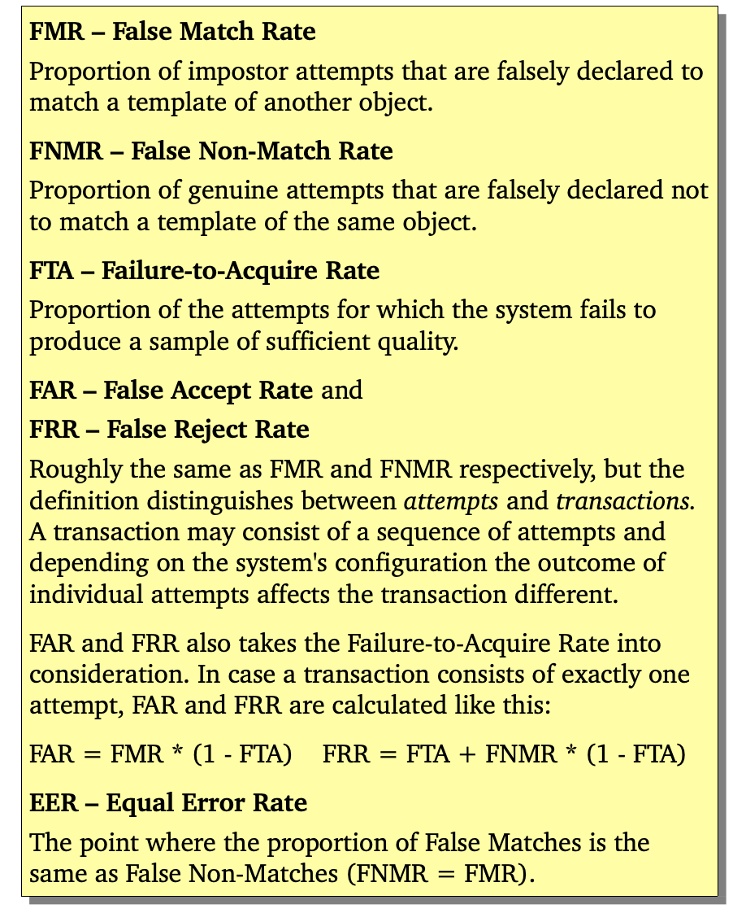
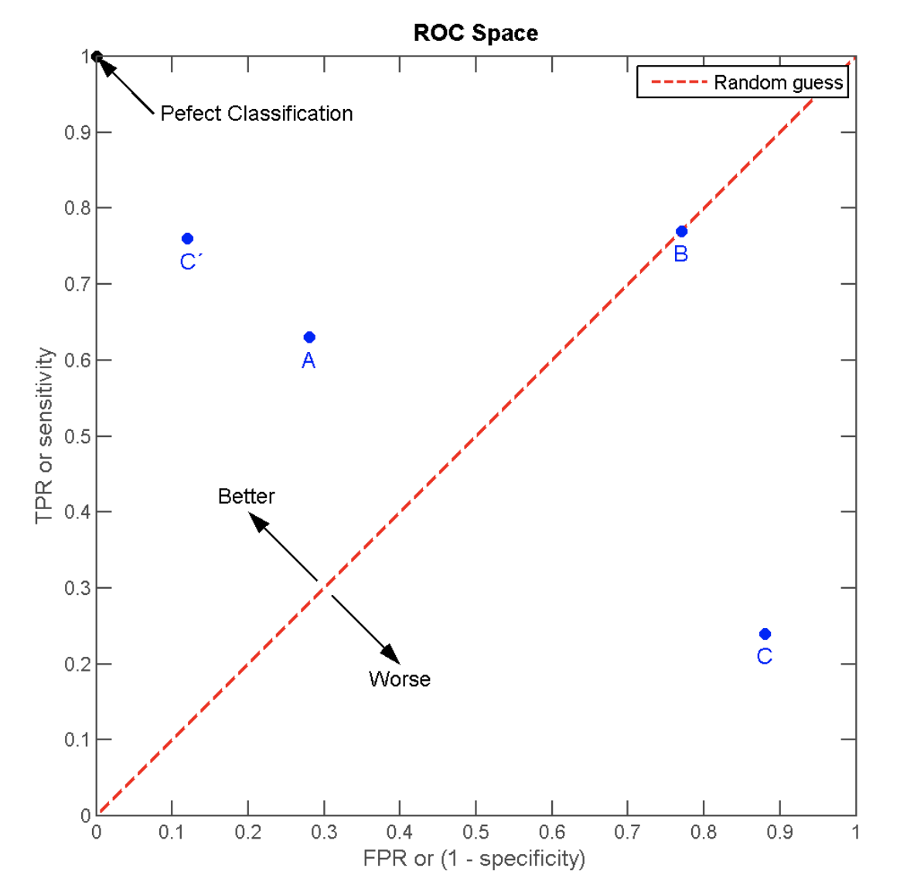
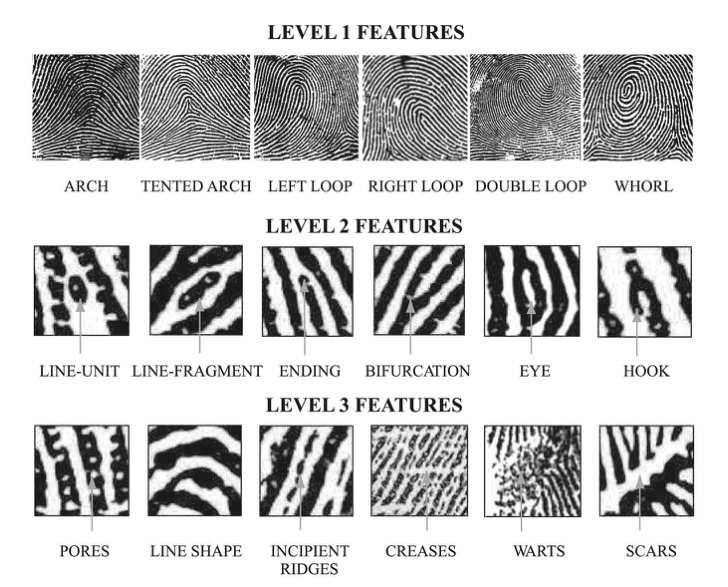

# Handbook of Fingerprint Recognition 

- Chapter 1 introduces biometric and fingerprint systems and provides some historical remarks on fingerprint and their adoption in forensic and civilian recognition applications.
- Chapter 2 surveys the existing fingerprint acquisition techniques. And chapter 2 also introduces the compression techniques that are used to efficiently store fingerprint images in a compact form.
- Chapter 3, 4, and 5 provide an in-depth treatment of fingerprint feature extraction(指纹特征提取), matching(匹配) and classification(分类), respectively.
- Chapter 6, 7, and 8 are specifically dedicated to the three cutting edges: synthetic fingerprint generation(合成指纹生成), biometric fusion(生物特征融合), and fingerprint individuality(指纹唯一性), respectively. 
- Chapter 9 discuss the security issues and countermeasure techniques that are useful in building secure fingerprint recognition systems.

## Chapter 1

### Biometric Systems

An important issue in designing a practical biometric system is to determind how an individual is going to be recognized. Depending on the application context, a biometric system may be called either a verification system or a identification system:
- A verfication system authenticates a person's identity by comparing the captured biometric characteristic with her previously captured (enrolled) biometric reference template pre-stored in the system. It conducts one-to-one comparision to confirm whether the claim of identity by the individual is true. A verfication system either rejects of accepts the submitted claim of identity.
- An identification system recognizes an individual by searching the entire enrollment template database for a match. It conduct one-to-many comparisons to establish if the individual is present in the database and if so, return the identifier of the enrollment reference that matched. In an identification system, the system establishes a subject's identity (or determines that the subject is not enrolled in the system database.) without the subject having to claim an identity.

The verification and identification process differ in whether an identity is claimed or not by the subject. A biometric claim (or claim of identity) is defined as the implicit or explicit claim that a subject is or is not the source of a specified or unspecified biometric enrollment template. （理解：验证系统和识别系统的区别在于是否需要声明用户声明身份，前者需要而后者不需要。）

> 验证系统通常使用username或PIN来表明身份（claim an identity）。

A claim may be:
- Positive: the subject is enrolled.
- Negative: the subject is not enrolled.
- Specific: the subject is or is not enrolled as a specified biometric enrollee.
- Non-specific: the subject is or is not among a set or subset of biometric enrollees.

The following three types of claims are used depending on the application context:
- Specific positive claim: applications such as logical access control (e.g., network-logon) may require a specific positive claim of identity (e.g., through a username or PIN). (This scenario need a verification biometric system)
- Non-specific positive claim: applications such as physical access control may assume a non-specific positive claim that the subject is someone who is authorized to access the facility. (This scenario need an identification biometric system).
- Non-specific negative claim: applications such as border crossing.

### Comparison of Traits

Any human anatomical or behavioral trait can be used as biometric identifier to recognize a person as long as it satisfies the following requirements:
- Universality: every person should possess the biometric trait.（每个人应该都有该特征）
- Distinctiveness: any two persons should be sufficiently different in terms of their biometric traits.（任意两个人的该特征都应该能够区别）
- Permanence: 
- Collectability: biometric trait can be measured quantitatively. （特征可以被定量采集）

### System Error

**Reasons behind system errors**

There are three primary reasons that explain the errors made by a biometric system (see Jain et al. (2004b)):
- Information limitation
- Representation limitation
- Invariance limitation

#### Matching module error

The result of a fingerprint matching module is typically a matching score (without loss of generality, lying in the interval [0, 1]) that quantifies the similarity between the recognition feature set and the enrollment template. The closer the score is to 1, the more certain is the system that the recognition feature set comes from the same finger as the enrollment template. The decision module regulates its decision by using a threshold t; 

**Verification error**

When the matching module is operating in one-to-one comparison mode (it compares feature set from one finger with template from one finger), it give a match or non-match decision depending on whether the comparsion score exceeded the threshold or not, respectively. The matching module, operating in one-to-one comparision mode, can commit two types of errors:
1. mistaking feature set and template from two different fingers to be from the same finger (called false match).
2. mistaking feature set ana template from the same finger to be from two different fingers (called false non-match)

It is important to understand the difference between false match and false non-match errors and the more commonly used false acceptance and false rejection errors. The false match and false non-match are errors of the mathcing module in one-to-one comparison mode while false acceptance and false rejection are the error rates associated with verification and identification processes and in fact their exact meaning is dependent upon the type of identity claim made by the user.

**Idetification error**

When a biometric system operates in the idetification mode, machting module works in one-to-many comparison mode. In t 

In fact, both FMR and FNMR are functions of the system threshold t, and we should, therefore, refer them as FMR(t) and FNMR(t), respectively. 

In practise, because the genuine and imposter score distributions are not continuous (due to the finite number of comparisions and the quantization of the output scores), an exact EER point might not exist. In this case, instead of a single value, an interval is reported.

## 生物识别中的评价标准

- FAR(False Acceptance Rate)：错误接受率，即把错误的识别成正确占原有所有错误的比率（白话：所有负例中被识别成正例的比例）。
- FRR(False Rejection Rate)：错误拒绝率，即把正确的识别成错误占原有所有正确的比率（白话：所有正例中被识别成负例的比例）。
- FMR(False Match Rate)：错误匹配率，等价于FAR(不考虑FTA)。
- FNMR(False Non-Macth Rate)：错误不匹配率，等价于FRR(不考虑FTA)。
- FPR(False Positive Rate)：真阳性率。
- TPR(True Positive Rate)：伪阳性率。
- EER(Equal Error Rate)：等错误率，即FMR == FNMR对应的点。EER越低则代表该系统识别精度越高。

两种曲线：
- ROC(Receiver Operating Curve)曲线。
- DET(Detection Error Tradeoff)曲线。

> impostor: 冒名顶替者
> genuine: 真实

### ROC曲线画法

A system designer may not know in advance the particular application where the fingerprint system would be depolyed. So it is advisable to report system performance at all operating points (threshold, t). This is done by plotting a Receiver Operating Characteristic (ROC) curve (or a Detection-Error Tradeoff curve, DET).

ROC空间将FPR(FAR)定义为X轴，TPR(1-FRR)定义为Y轴。

给定一个二元分类模型和它的阈值，就能从所有样本真实值和预测值计算出一个（X=FPR, Y=TPR）。其中：
- 二元分类模型会对样本进行预测并将预测值标准化到连续区间[0, 1]。
- 根据阈值则会进一步将将预测值映射为0或1。

将同一个模型每个阈值的（FPR, TPR）坐标都画在ROC空间，就成为特定模型的ROC曲线。

但在同一个分类器之内，阈值的不同设定对ROC曲线的影响，仍有一些规律可循：
- 当阈值设为最高时，亦即所有样本都被预测为阴性，没有样本被预测为阳性。此时FP = 0，TP = 0。因此当阈值设定为最高时，必得出ROC坐标系左下角的点(0, 0)。
- 当阈值设为最低时，亦即所有样本都被预测成阳性，没有样本被预测成阴性。此时TN = 0，FN = 0，即FPR = 100%，TPR = 100%。因此当阈值设定为最低时，必得出ROC坐标系右上角的点(1, 1)。
- TPR、FPR的分母是分别是阳性个数和阴性个数，不随阈值改变。对于TPR，其分子TP由于阈值降低，判断为阳性的门槛降低，则TP只会增多或者不变，进而TPR只会变大或者不变；对于FPR同理，其分子FP由于阈值降低，判断为阳性的门槛降低，则FP只会变大或不变，进而FPR只会变大或不变。因此当阈值降低时，ROC点往右上（或右/或上）移动，或不动；但绝不会往左下（或左/或下）移动。

### Fingerprint Recognition Technique

#### Fingerprint Sensing

Based on the mode of acquisition, a fingerprint image may be classified as off-line and live-line.

#### Fingerprint Classification and Indexing

Fingerprint classification refers to the problem of assigning a fingerprint to a class in a consistent and reliable way. 

fingerprint classification is generally based on global features, such as global ridge structure and singularities. 

#### Syntheic Fingerprints

#### Biometric Fusion

History of fingerprint:
- **Fingerprint technique was initiated.** It was not until the last 
- ****In 1864, Nehemiah Grew, published the first scientific paper reporting his systematic study on the ridge, furrow, and pore structure in fingerprint.  
- In 1823, Purkinje, proposed the first fingerprint classification scheme, which classified fingerprints into nice categories according to the ridge configurations.
- **Fingerprint databases were established.** Fingerprint identification agencies were set up worldwide and criminal fingerprint databases were established.
- **AFISs appear.** With the rapid expansion of fingerprint recognition in forensics, operational fingerprint databases became so huge that manual fingerprint identification became infeasible. Starting in the early 1960s, the FBI, Home Office in the UK, and Paris Police Department began to invest a large amount of effort in developing automatic fingerptint identification systems (AFISs).
- 

One of the most important fine-level details is the finger sweat pores, whose positions and shapes are considered highly distintive. However, extracting very-fine details including pores is feasible only in high-resolution fingerprint images of good quality and therefore this kind of representation is not pracical for non-forensic applications.

A (three-class) categorization of fingerprint mathcing apporaches is:
- Correlation-based mathcing（基于相关性匹配）: two fingerprint images are superimposed and the correlation between corresponding pixels is computed for different alignments (e.g., various displacements and rotations).
- Minutiae-based mathcing（基于Minutiae匹配）: minutiae are extracted from two fingerprints and stored as sets of points in the two-dimensional plane. Minutiae mathcing essentially consists of finding the alignment between the template and the input minutiae sets that results in the maximum number of minutiae pairings.
- Non-minutiae feature-based mathcing（非minutiae特征匹配）

> Minutiae是指纹的特征。

## chapter 3 Fingerprint Analysis and Representation

**Level 1 (global ridge flow patterns)** is macro detail such as ridge flow and pattern type.

**Level 2 (local minutiae points)** is the Galton characteristics, or minutiae points such as bifurcations and endings.

**Level 3 (shape)** includes all dimensional attributes of a ridge, such as ridge path deviation, width, shape, pores, edge contour, incipient ridges, breaks, creases, scars, and other permanent details. 

statistical analysis has shown that Level 1 features, or fingerprint pattern, though not unique, are useful for classification purpose, while Level 2 features, or points, have sufficient discriminating power to establish the individuality of fingerprint[xx].

Minutiae

