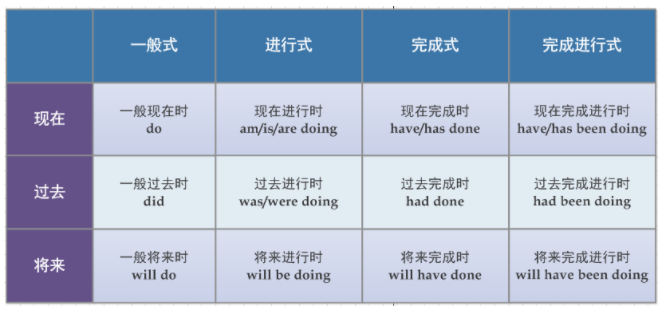
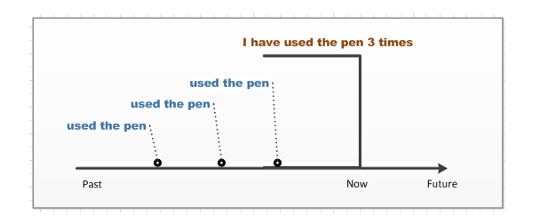
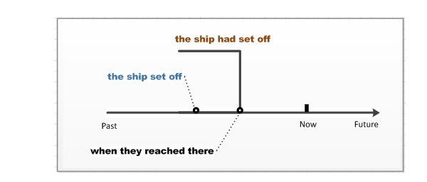
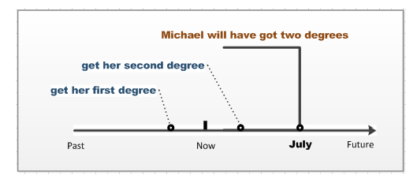

# 英语

学英语本质上就是为了读懂句子、造句。

句子有些十分长、十分复杂，但究其本质不过是简单句子的并列或者复合，因此要想读懂这些句子以及写出这些句子，一起都得从简单句开始。

## 简单句

简单句就是句子意思完整的不可再拆分的句子。

表达出“什么怎么样”的句子才算是句意完整：
- “什么”在这里相当于主语。
- “怎么样”在这里相当于谓语。

“怎么样“通常表达一个广义的动作（发生了什么事）。而这个广义的动作就是语法上的动词，这个动词称为谓语动词。

根据动词的不同以及需要补充的信息以使句意完整，简单句的可以分为五种基本句式：
- 主语 + 不及物动词(eg. sleep)。
- 主语 + 单及物动词(eg. eat) + 宾语。
- 主语 + 双及物动词(eg. buy) + 间接宾语 + 直接宾语。
- 主语 + 复杂及物动词(eg. want) + 宾语 + 宾语补足语(补语)。
- 主语 + 连系动词(eg. is)+ 主语补足语(表语)。

句子成分：
- 主语，表达句子的主体对象。
- 谓语动词（谓语）。
- 宾语，表达动作的承受者对象。
- 宾语补足语，补充说明宾语的信息。
- 表语，表达主语的属性。
- 定语，限定修饰对象的性质，相当于一个形容词。
- 状语，表达时间、地点、条件、原因、结果、让步、伴随、目的、方式。
- 同位语，表达同一事物。

同一个句子成分中可能有不同的词类，英语中主要的词类有以下：
- 名词。
- 冠词。
- 代词。
- 形容词。
- 数词。
- 副词。
- 介词。
- 叹词。
- 连词。
- 动词。

## 长句

长句不过是简单句的并列或者复合。

因此长句有两种：
- 复合句（compound clause），简单句通过连词连接构成并列关系，无主次之分。
- 复杂句（complex clause），简单句通过关系词连接构成复合关系，有主次之分。

谓语动词可以表示：
- 表示动作的时间（时）
- 表示动作的状态（体）
- 表示动作的假设，情感（气）

但是谓语动词本身无法独立完成这些，需要助动词的帮助，助动词无实意。

## 非谓语动词

非谓语动词又称非限制性动词，即不受主语的人称和数的限制，并且不表示时间，但可以表示主动和被动态。

非谓语动词可以充当除谓语动词之外的所有句子成分，取代几乎所有的从句，从而简化句子。

非谓语动词主要有四种形式：
- 动词不定式。
- 动名词
- 过去分词。
- 现在分词。

### 动词不定式

动词不定式都基本形式：`to + 动词原形`。

动词不定式具有名词、形容词、副词的特征，因此这些词能够充当的成分，也可以使用动词不定式来充当。

**动词不定式充当主语**

eg.

`(To eat a carrot every day) is good for rabbit.`

等价但更常用的形式，使用it形式主语：

`It is good for rabbit (to eat a carrot every day).`

**动词不定式充当宾语**

eg.

`The rabbit likes (to eat carrot).`

> :warning: 有些动词后面不能接动词不定式作宾语。
> 例如：enjoy、avoid、mind、practise、feel like、insist on等等。

等价但更常用的形式，使用it形式宾语。

`I consider it important (to eat a carrot every day).`

**动词不定式充当宾语补语**

eg.

`The rabbit expected the wolf (to eat a carrot).`

**动词不定式充当定语**

动词不定式充当定语，通常与所修饰的名词存在动宾关系。
> :warning: 注意不定式为不及物动词时，所修饰的名词是地点、工具等，应有必要的介词。

eg.

`The rabbit has a lot of carrot to eat.`

**动词不定式充当状语**

eg. 表原因

`I was surprised to get a thumbs-up.`

eg. 表目的

`I will do everything to get a thumbs-up.`

eg. 表结果

`I got enough thumbs-up to make another video.`

**高级不定式**

将不定式与状态相结合。

### 动名词

动名词形式：`动词 + ing`。

动名词顾名思义就相当于一个名词，因此名词可以在句子当承担的成分动名词也可以。

**动名词充当主语**

eg.

`(Eating carrots) is healthy for the rabbit.`

**动名词充当宾语**

eg.

``

**动名词充当表语**

eg.

`The rabbit's hobby is (growing carrots).`

**动名词充当定语**

 

### 现在分词

现在分词的形式：`动词 + ing`。

现在分词具有形容词和副词的特征，因此这些词可以充当的成分，也可以使用现在分词来充当。

**现在分词充当定语**

现在分词充当定语，当分词单独作定语时，放在被修饰词前面；如果是分词短语作定语放在被修饰词后面。

eg.

`In the (following) years he worked even harder.`

eg. 

`The man (speaking to the teacher) is our monitor's father.`

现在分词作定语相当于定语从句功能，因此可以用来简化句子。

eg.

`In the years that followed he worked even harder.`

eg.

`The man who is speaking to the teacher is our monitor's father.`

**现在分词充当状语**

### 过去分词

过去分词具有形容词和副词的特征，因此这些词可以充当的成分，也可以使用过去分词来充当。

**过去分词充当定语**

过去分词充当定语，当分词单独作定语时，放在被修饰词前；如果是分词短语作定语则放在被修饰词后面。

eg.

`Our class went on an (organized) trip last Monday.`

eg.

`Those (selected as committee members) will attend the meeting.`

过去分词作定语相当于定语从句功能，因此可以用来简化句子。

**过去分词充当表语**

eg.

`The window is broken.`

## 时态

时态是用来描述动作发生的时间和状态。

时间有三类：
- 过去
- 现在
- 将来（will）

任何一个动作都必然发生在过去、现在或者将来。

状态指的是某个时刻这个动作所处的状态。

状态一共有四种：
- 一般式，指普通的动作没有特别强调其状态，动词形式为do。
- 进行式，指动作正在进行，动词形式为be+doing。
- 完成式，对"之前发生动作"完成情况的总结，动词形式为have+done。
- 进行完成式，对"正在进行的动作"完成情况的总结,并且该动作还可能继续进行下去，的动词形式为have+been+doing。

将三种时间和四种状态结合起来，可得到下表所示的十二类时态。

:star:完成时态都是站在某个时间点，对这个时间点之前发生的动作做一个总结。所以，如果句子的上下文中没有明确的表示出这个时间点，就不能使用完全式，使用完全式则一定有明确的时间点。

参考链接：[如何准确使用英语时态？](https://www.zhihu.com/question/31924369/answer/196401680)

## 语态

语态分为主动语态和被动语态，其中主动语态可以看成时态因为用法上没什么区别。

### 例句

**现在完成时**

I have used the pen only three times.

- have为原型引出现在。
- 现在的不需要知名时间点。
- 动作完成情况：only three times.

**过去完成时**

When he reached here, the ship had set off.

- had为过去时引出过去。
- 过去的时间点为：when he reached here
- 动作完成情况：set off

**将来完成时**

By July, Michael will have got two college degrees.

- 由will引出将来。
- 将来的时间点：By July.
- 动作完成情况：two college degrees.

**现在完成进行时**

**过去完成进行时**

**将来完成进行时**

